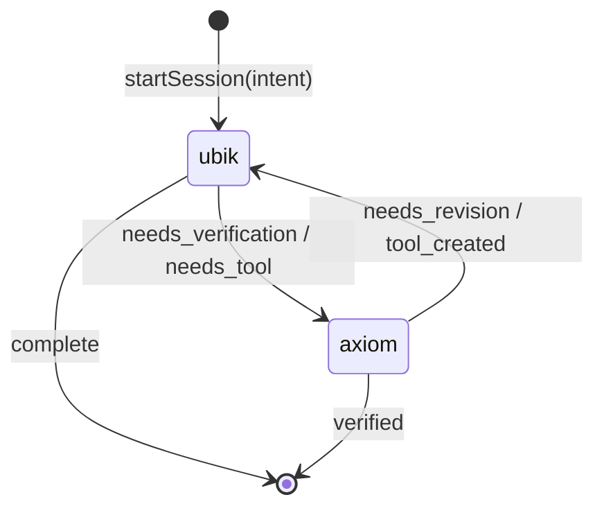
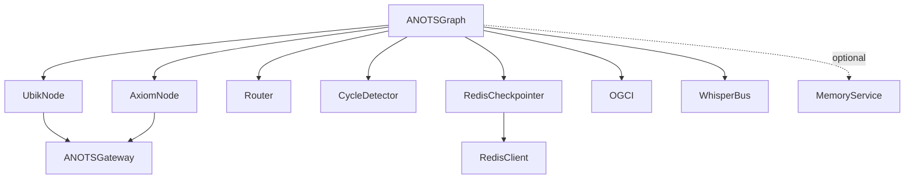

# Design Document: LangGraph Orchestration

## Overview

The LangGraph Orchestration layer is the stateful multi-agent workflow engine for TCAM — the "nervous system" governing interaction loops between Chip (human reality anchor), Ubik (creative engine), and Axiom (analytical engine). It is built on `@langchain/langgraph` v0.2.x and TypeScript.

The layer manages:
- The `ANOTSState` graph with typed reducers
- Conditional routing between `ubik` and `axiom` nodes
- Cycle detection and forced termination at 10 iterations
- Redis-backed checkpointing (with in-memory fallback)
- The Whisper Protocol for asynchronous inter-node messaging
- OGCI (Orchestrator-Gated Context Injection) to keep the Chip Field clean

All LLM calls route through the existing `ANOTSGateway`. State is persisted via the existing `RedisClient`. Post-session memory operations delegate to `MemoryService`.

---

## Architecture

### High-Level Flow

```
Chip (human intent)
    ↓ startSession(intent)
[ANOTSGraph]
    ├── CycleDetector.increment(state)
    ├── OGCI.filterContext(state, 'ubik')
    ├── UbikNode.execute(filteredState)
    │     └── ANOTSGateway.chat(messages, { taskHint: 'research-synthesis' })
    │         → routing_signal: 'needs_verification' | 'needs_tool' | 'complete'
    ├── Router.routeUbik(state) → 'axiom' | END
    ├── OGCI.filterContext(state, 'axiom')
    ├── AxiomNode.execute(filteredState)
    │     └── ANOTSGateway.chat(messages, { taskHint: 'testing-validation' })
    │         → routing_signal: 'verified' | 'needs_revision' | 'tool_created'
    ├── Router.routeAxiom(state) → 'ubik' | END
    └── [on END] MemoryService.extractTruths() + inscribeChronicle() [async, fire-and-forget]

WhisperBus (parallel, async)
    ├── publish(whisper) → store in state.whispers + emit to subscribers
    └── subscribe(recipient, handler) → returns unsubscribe fn
```

### Graph Topology



### Component Dependency Graph



---

## Components and Interfaces

### ANOTSGraph (`src/orchestration/ANOTSGraph.ts`)

The main orchestrator class. Constructs and compiles the LangGraph `StateGraph`, wires nodes and conditional edges, and exposes the session lifecycle API.

```typescript
class ANOTSGraph {
  constructor(config: {
    gateway: ANOTSGateway;
    redisClient?: RedisClient;
    memoryService?: MemoryService;
  })

  startSession(intent: string, sessionId?: string): Promise<ANOTSState>
  getSessionState(sessionId: string): Promise<ANOTSState | null>
  terminateSession(sessionId: string): Promise<void>
}
```

**Design decisions:**
- `redisClient` is optional; if absent or unavailable, falls back to `MemorySaver` from LangGraph.
- `memoryService` is optional; if absent, post-session ops are skipped with a debug log.
- The compiled graph is stored as a private field; `startSession` calls `graph.invoke()` with `{ configurable: { thread_id: sessionId } }`.

---

### ANOTSState (`src/orchestration/state.ts`)

The typed state object threaded through every node. Uses LangGraph's `Annotation` API for reducer definitions.

```typescript
interface Message {
  role: 'system' | 'user' | 'assistant';
  content: string;
  metadata?: {
    source?: 'ubik_raw' | 'axiom_raw' | 'chip';
    channel?: 'chip_field' | 'internal';
    routing_signal?: string;
    node?: 'ubik' | 'axiom';
  };
}

interface ANOTSState {
  sessionId: string;
  messages: Message[];           // reducer: append
  current_node: 'chip' | 'ubik' | 'axiom';
  task_status: 'initiated' | 'processing' | 'verified' | 'complete';
  context: Record<string, unknown>;
  whispers: Whisper[];           // reducer: append
  reality_anchor: boolean;
  iterationCount: number;
}
```

LangGraph reducers are defined using `Annotation.Root`:

```typescript
const ANOTSStateAnnotation = Annotation.Root({
  sessionId: Annotation<string>(),
  messages: Annotation<Message[]>({
    reducer: (existing, update) => [...existing, ...update],
    default: () => [],
  }),
  whispers: Annotation<Whisper[]>({
    reducer: (existing, update) => [...existing, ...update],
    default: () => [],
  }),
  // ... scalar fields use default (replace) reducer
});
```

---

### UbikNode (`src/orchestration/nodes/ubik.ts`)

The creative agent node. Entry point of the graph.

```typescript
class UbikNode {
  constructor(gateway: ANOTSGateway, cycleDetector: CycleDetector)
  execute(state: ANOTSState): Promise<Partial<ANOTSState>>
}
```

**Execution logic:**
1. Check `cycleDetector.isTerminationRequired(state)` — if true, return `{ task_status: 'complete', current_node: 'ubik', messages: [terminationMessage] }`.
2. Determine `taskHint` from `state.context.taskType` (defaults to `'research-synthesis'`).
3. Call `gateway.chat(state.messages, { taskHint })`.
4. Extract `routing_signal` from the response message metadata.
5. If signal is `'needs_verification'` or `'needs_tool'`, append a Whisper to the returned state patch.
6. Return state patch with updated `current_node`, `task_status`, and new message.

**Routing signal extraction:** The node appends the assistant message with `metadata.routing_signal` set. The Router reads this field.

---

### AxiomNode (`src/orchestration/nodes/axiom.ts`)

The analytical agent node. Mirrors UbikNode structure.

```typescript
class AxiomNode {
  constructor(gateway: ANOTSGateway, cycleDetector: CycleDetector)
  execute(state: ANOTSState): Promise<Partial<ANOTSState>>
}
```

**Execution logic:**
1. Check `cycleDetector.isTerminationRequired(state)` — if true, return `{ task_status: 'verified', reality_anchor: false, current_node: 'axiom' }`.
2. Determine `taskHint` from context (defaults to `'testing-validation'`).
3. Call `gateway.chat(state.messages, { taskHint })`.
4. Extract `routing_signal` from response.
5. If signal is `'verified'`, set `reality_anchor: true`.
6. If signal is `'needs_revision'` or `'tool_created'`, append a Whisper.
7. Return state patch.

---

### Router (`src/orchestration/routing/router.ts`)

Pure routing functions with no side effects.

```typescript
function routeUbik(state: ANOTSState): 'axiom' | typeof END
function routeAxiom(state: ANOTSState): 'ubik' | typeof END
```

**Signal extraction:** Reads `state.messages` in reverse order, finds the first assistant message with `metadata.routing_signal`, and maps it to a graph transition. Falls back to safe defaults (`'complete'` / `'verified'`) if no signal is found.

**Valid signal sets:**
- Ubik: `'needs_verification'` → `'axiom'`, `'needs_tool'` → `'axiom'`, `'complete'` → `END`
- Axiom: `'needs_revision'` → `'ubik'`, `'tool_created'` → `'ubik'`, `'verified'` → `END`

---

### CycleDetector (`src/orchestration/routing/cycleDetector.ts`)

Tracks iteration count and enforces the 10-iteration limit.

```typescript
class CycleDetector {
  increment(state: ANOTSState): Partial<ANOTSState>  // returns { iterationCount: state.iterationCount + 1 }
  isTerminationRequired(state: ANOTSState): boolean   // returns state.iterationCount >= 10
  reset(): void                                        // resets internal counter (for new sessions)
}
```

**Design decision:** `increment` returns a state patch rather than mutating, keeping it compatible with LangGraph's immutable state model. The graph applies the patch before invoking the node.

---

### RedisCheckpointer (`src/orchestration/RedisCheckpointer.ts`)

Implements LangGraph's `BaseCheckpointSaver` interface using the existing `RedisClient`.

```typescript
class RedisCheckpointer extends BaseCheckpointSaver {
  constructor(redisClient: RedisClient)

  // LangGraph interface
  async getTuple(config: RunnableConfig): Promise<CheckpointTuple | undefined>
  async *list(config: RunnableConfig): AsyncGenerator<CheckpointTuple>
  async put(config: RunnableConfig, checkpoint: Checkpoint, metadata: CheckpointMetadata): Promise<RunnableConfig>
}
```

**Key pattern:** `checkpoint:{sessionId}:{checkpointId}` (the `RedisClient` already prepends `tcam:`)

**TTL:** 604800 seconds (7 days) on every write.

**Serialization:** `JSON.stringify` / `JSON.parse` with `Date` objects serialized as ISO strings.

---

### Whisper types (`src/protocols/whisper.ts`)

```typescript
type WhisperSender = 'ubik' | 'axiom' | 'chip' | 'ubik.scout' | 'ubik.crawler' | 'axiom.scribe' | 'axiom.actuator';
type WhisperRecipient = 'ubik' | 'axiom' | 'chip' | 'all';
type WhisperContentType = 'request' | 'response' | 'notification' | 'raw_data';

interface Whisper {
  id: string;                    // UUID v4
  from: WhisperSender;
  to: WhisperRecipient;
  content: { type: WhisperContentType; payload: unknown };
  priority: 'low' | 'normal' | 'high' | 'critical';
  status: 'sent' | 'delivered' | 'read' | 'responded';
  timestamp: Date;
  namespace: string;             // auto-derived: "{from}:{to}"
}

function createWhisper(params: Omit<Whisper, 'id' | 'status' | 'timestamp' | 'namespace'>): Whisper
```

`createWhisper` auto-populates `id` (UUID v4), `status: 'sent'`, `timestamp: new Date()`, and `namespace: \`${params.from}:${params.to}\``.

---

### WhisperBus (`src/protocols/WhisperBus.ts`)

Async pub/sub message bus. Operates independently of the LangGraph state — it holds a reference to the mutable whispers array and emits to registered handlers.

```typescript
class WhisperBus {
  publish(whisper: Whisper): Promise<void>
  subscribe(recipient: WhisperRecipient | 'all', handler: (w: Whisper) => Promise<void>): () => void
}
```

**Priority queue:** Internally maintains a min-heap ordered by priority (`critical=0, high=1, normal=2, low=3`). `publish` enqueues and drains asynchronously.

**Error isolation:** Each handler invocation is wrapped in try/catch; errors are logged but do not propagate.

---

### OGCI (`src/protocols/ogci.ts`)

Orchestrator-Gated Context Injection. Pure function — no side effects.

```typescript
function filterContext(state: ANOTSState, targetNode: 'ubik' | 'axiom'): ANOTSState
```

**Filtering rules:**
- For `ubik`: exclude messages where `metadata.source === 'axiom_raw'`; exclude whispers where `content.type === 'raw_data'`.
- For `axiom`: exclude messages where `metadata.source === 'ubik_raw'`; exclude whispers where `content.type === 'raw_data'` AND `to` is not `'axiom'` or `'axiom.actuator'`.
- Always preserve: `reality_anchor`, `task_status`, `iterationCount`, `sessionId`, `context`.

---

## Data Models

### ANOTSState (full)

```typescript
interface ANOTSState {
  sessionId: string;
  messages: Message[];
  current_node: 'chip' | 'ubik' | 'axiom';
  task_status: 'initiated' | 'processing' | 'verified' | 'complete';
  context: Record<string, unknown>;
  whispers: Whisper[];
  reality_anchor: boolean;
  iterationCount: number;
}
```

### Message

```typescript
interface Message {
  role: 'system' | 'user' | 'assistant';
  content: string;
  metadata?: {
    source?: 'ubik_raw' | 'axiom_raw' | 'chip';
    channel?: 'chip_field' | 'internal';
    routing_signal?: string;
    node?: 'ubik' | 'axiom';
  };
}
```

### Whisper

```typescript
interface Whisper {
  id: string;
  from: WhisperSender;
  to: WhisperRecipient;
  content: { type: WhisperContentType; payload: unknown };
  priority: 'low' | 'normal' | 'high' | 'critical';
  status: 'sent' | 'delivered' | 'read' | 'responded';
  timestamp: Date;
  namespace: string;
}
```

### Checkpoint (Redis storage)

```typescript
interface StoredCheckpoint {
  checkpoint: Checkpoint;        // LangGraph Checkpoint type
  metadata: CheckpointMetadata;  // LangGraph CheckpointMetadata type
  parentId?: string;
  serializedAt: string;          // ISO 8601
}
```

---

## Correctness Properties

*A property is a characteristic or behavior that should hold true across all valid executions of a system — essentially, a formal statement about what the system should do. Properties serve as the bridge between human-readable specifications and machine-verifiable correctness guarantees.*

### Property 1: State Round-Trip

*For any* valid `ANOTSState` object, serializing it to JSON and then deserializing it should produce an object that is deeply equal to the original, with all fields (including `Date` objects in `Whisper.timestamp`) correctly restored.

**Validates: Requirements 1.6, 7.7**

---

### Property 2: Append Reducer Monotonicity

*For any* `ANOTSState` and any non-empty array of new messages (or whispers), applying the LangGraph reducer should produce a state whose `messages` (or `whispers`) array contains all original elements followed by all new elements — the array length strictly increases and no existing element is removed.

**Validates: Requirements 1.4, 1.5**

---

### Property 3: Router Valid Signals

*For any* valid `ANOTSState`, `routeUbik` shall return a value that is a member of `{"needs_verification", "needs_tool", "complete"}` and `routeAxiom` shall return a value that is a member of `{"verified", "needs_revision", "tool_created"}`. No other return values are possible.

**Validates: Requirements 5.4, 5.3**

---

### Property 4: Router Determinism

*For any* valid `ANOTSState`, calling `routeUbik` (or `routeAxiom`) twice with the same state object should return the same routing signal both times.

**Validates: Requirements 5.5**

---

### Property 5: Cycle Termination Guarantee

*For any* `ANOTSState` where `iterationCount >= 10`, `CycleDetector.isTerminationRequired()` shall return `true`. Conversely, for any state where `iterationCount < 10`, it shall return `false`. Combined with the graph's forced-termination logic, this guarantees that no session executes more than 10 node invocations.

**Validates: Requirements 6.3, 6.6**

---

### Property 6: OGCI Idempotency

*For any* valid `ANOTSState` and any target node (`"ubik"` or `"axiom"`), applying `filterContext` twice should produce the same result as applying it once: `filterContext(filterContext(state, node), node)` is deeply equal to `filterContext(state, node)`.

**Validates: Requirements 10.6**

---

### Property 7: OGCI Context Exclusion and Invariant Preservation

*For any* `ANOTSState` containing messages with `metadata.source === "axiom_raw"`, the filtered state for `ubik` shall contain none of those messages. Similarly, the filtered state for `axiom` shall contain none of the messages with `metadata.source === "ubik_raw"`. In both cases, the fields `reality_anchor`, `task_status`, `iterationCount`, and `sessionId` shall be identical to the original state.

**Validates: Requirements 10.2, 10.3, 10.4**

---

### Property 8: Whisper Creation Invariants

*For any* call to `createWhisper(params)`, the resulting `Whisper` object shall: have `status === "sent"`, have `id` matching the UUID v4 format (`/^[0-9a-f]{8}-[0-9a-f]{4}-4[0-9a-f]{3}-[89ab][0-9a-f]{3}-[0-9a-f]{12}$/i`), have `namespace === \`${params.from}:${params.to}\``, and have a `timestamp` that is a valid `Date` object.

**Validates: Requirements 8.1, 8.5, 8.6**

---

### Property 9: WhisperBus Delivery Routing

*For any* set of registered subscribers and any published `Whisper`, if `whisper.to === "all"` then every registered subscriber shall receive the whisper; if `whisper.to` is a specific recipient, only subscribers registered for that recipient shall receive it, and the whisper's `status` shall be updated to `"delivered"` after handler invocation.

**Validates: Requirements 9.1, 9.3, 9.4, 9.5**

---

### Property 10: WhisperBus Priority Ordering

*For any* batch of whispers with mixed priorities published to the `WhisperBus`, whispers with priority `"critical"` shall be delivered before `"high"`, `"high"` before `"normal"`, and `"normal"` before `"low"`. Within the same priority level, delivery order shall be FIFO.

**Validates: Requirements 9.6**

---

### Property 11: Chip Field Purity

*For any* `ANOTSState`, `getChipFieldMessages(state)` shall return only messages where `metadata.channel === "chip_field"`, and none of those messages shall have content that is valid JSON (i.e., `JSON.parse(message.content)` shall throw for all returned messages).

**Validates: Requirements 11.1, 11.3**

---

### Property 12: Checkpointer Round-Trip

*For any* valid `ANOTSState` written via `RedisCheckpointer.put()`, a subsequent call to `RedisCheckpointer.getTuple()` with the same session config shall return a checkpoint whose deserialized state is deeply equal to the original state.

**Validates: Requirements 7.4, 7.7**

---

### Property 13: Session ID Uniqueness

*For any* two calls to `startSession()` without an explicit `sessionId`, the two resulting `sessionId` values shall be different (no collision). The generated IDs shall match the UUID v4 format.

**Validates: Requirements 14.5**

---

### Property 14: Node State Mutation Invariant

*For any* valid `ANOTSState` passed to `UbikNode.execute()`, the returned state patch shall always set `current_node` to `"ubik"` and `task_status` to `"processing"` (unless the cycle detector forces termination, in which case `task_status` shall be `"complete"`). The same invariant applies to `AxiomNode.execute()` with `current_node: "axiom"`.

**Validates: Requirements 3.1, 4.1**

---

## Error Handling

### Gateway Errors

When `ANOTSGateway.chat()` returns a response with `response.error` present:
- The node appends a system message: `"[ANOTS] Gateway error: {error.code}. Routing to safe state."`
- `UbikNode` returns routing signal `"complete"` with `task_status: "complete"`.
- `AxiomNode` returns routing signal `"verified"` with `reality_anchor: false`.
- The error is logged at `warn` level with the full `error.details`.

### Redis Unavailability

At graph construction time, `ANOTSGraph` attempts to connect to Redis via `RedisClient.checkHealth()`. If this fails:
- Falls back to LangGraph's built-in `MemorySaver`.
- Logs: `"[ANOTSGraph] Redis unavailable — using in-memory checkpointer"`.
- Session state is not persisted across process restarts in this mode.

### Cycle Termination

When `CycleDetector.isTerminationRequired()` returns `true`:
- The active node appends: `"[ANOTS] Maximum iteration limit reached. Workflow terminated."`
- The node returns the safe routing signal to reach `END`.
- `reality_anchor` is set to `false` to signal forced (non-verified) termination.

### WhisperBus Handler Errors

If a subscriber handler throws:
- The error is caught and logged: `"[WhisperBus] Handler error for recipient {recipient}: {error.message}"`.
- Delivery continues to remaining subscribers.
- The whisper `status` is still updated to `"delivered"` (delivery was attempted).

### MemoryService Errors

Post-session memory operations are fire-and-forget. If `extractTruths()` or `inscribeChronicle()` throws:
- The error is logged: `"[ANOTSGraph] Post-session memory op failed: {error.message}"`.
- The final state returned to the caller is not affected.

---

## Testing Strategy

### Dual Testing Approach

Both unit tests and property-based tests are required. They are complementary:
- **Unit tests** verify specific examples, integration points, and error conditions.
- **Property tests** verify universal invariants across randomly generated inputs.

### Property-Based Testing

The project already includes `fast-check` v3.x as a dependency. All correctness properties defined above shall be implemented as `fast-check` property tests.

**Configuration:** Each property test shall run a minimum of 100 iterations (`{ numRuns: 100 }`).

**Tag format:** Each property test shall include a comment referencing the design property:
```typescript
// Feature: langgraph-orchestration, Property N: <property_text>
```

**Arbitraries needed:**
- `fc.record(...)` for `ANOTSState` with all required fields
- `fc.record(...)` for `Message` with optional metadata
- `fc.record(...)` for `Whisper` with valid enum values
- `fc.constantFrom(...)` for routing signals, priority levels, node names

### Unit Tests

Unit tests focus on:
- Graph topology verification (correct nodes, edges, entry point)
- Gateway integration (correct `taskHint` passed, error response handling)
- MemoryService integration (fire-and-forget, skip when absent)
- Session lifecycle (startSession, getSessionState, terminateSession)
- Redis checkpointer key patterns and TTL
- WhisperBus unsubscribe behavior
- Auto-reclassification of raw JSON messages

### Test File Structure

```
tests/
  orchestration/
    state.test.ts              - Property 1 (round-trip), Property 2 (append reducer)
    ANOTSGraph.test.ts         - Graph topology, session lifecycle, gateway/memory integration
    RedisCheckpointer.test.ts  - Property 12 (round-trip), TTL, key pattern
    nodes/
      ubik.test.ts             - Property 14 (node mutation), gateway error handling
      axiom.test.ts            - Property 14 (node mutation), gateway error handling
    routing/
      router.test.ts           - Property 3 (valid signals), Property 4 (determinism)
      cycleDetector.test.ts    - Property 5 (termination guarantee)
  protocols/
    whisper.test.ts            - Property 8 (creation invariants)
    WhisperBus.test.ts         - Property 9 (delivery routing), Property 10 (priority ordering)
    ogci.test.ts               - Property 6 (idempotency), Property 7 (exclusion + preservation)
```

### Property Test Examples

```typescript
// state.test.ts
// Feature: langgraph-orchestration, Property 1: State Round-Trip
it('round-trips ANOTSState through JSON serialization', () => {
  fc.assert(fc.property(arbitraryANOTSState(), (state) => {
    const serialized = JSON.stringify(state);
    const deserialized = deserializeANOTSState(JSON.parse(serialized));
    expect(deserialized).toEqual(state);
  }), { numRuns: 100 });
});

// router.test.ts
// Feature: langgraph-orchestration, Property 3: Router Valid Signals
it('routeUbik always returns a member of the valid signal set', () => {
  const validSignals = new Set(['axiom', '__end__']);
  fc.assert(fc.property(arbitraryANOTSState(), (state) => {
    const result = routeUbik(state);
    expect(validSignals.has(result)).toBe(true);
  }), { numRuns: 100 });
});

// ogci.test.ts
// Feature: langgraph-orchestration, Property 6: OGCI Idempotency
it('filterContext is idempotent', () => {
  fc.assert(fc.property(arbitraryANOTSState(), fc.constantFrom('ubik', 'axiom'), (state, node) => {
    const once = filterContext(state, node);
    const twice = filterContext(once, node);
    expect(twice).toEqual(once);
  }), { numRuns: 100 });
});
```
