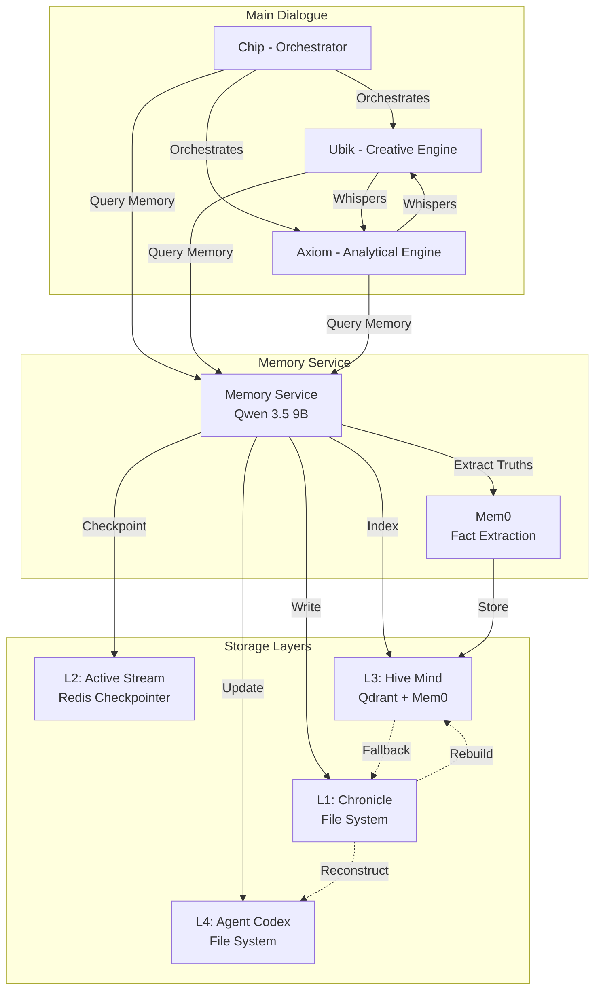

# Design Document: TCAM Memory System

## Document Information

**Spec ID:** 420612ea-211d-421c-8cfb-17263ee9ea9e  
**Workflow:** Requirements-First  
**Phase:** Design  
**Created:** 2025-03-22  
**Status:** In Progress  
**Whitepaper Reference:** Section 7 (Organic Memory System: Resilient 4-Layer Architecture)

---

## Table of Contents

1. [Overview](#1-overview)
2. [High-Level Architecture](#2-high-level-architecture)
3. [Component Design](#3-component-design)
4. [Data Models](#4-data-models)
5. [API Design](#5-api-design)
6. [Sleeping Cycle Workflow](#6-sleeping-cycle-workflow)
7. [Error Handling & Graceful Degradation](#7-error-handling--graceful-degradation)
8. [Technology Integration](#8-technology-integration)
9. [Performance Considerations](#9-performance-considerations)
10. [Security & Data Integrity](#10-security--data-integrity)
11. [Correctness Properties](#11-correctness-properties)
12. [Testing Strategy](#12-testing-strategy)

---

## 1. Overview

### 1.1 Purpose

The TCAM Memory System is the foundational infrastructure for TCAM v1.4, implementing a resilient 4-layer architecture where each layer operates independently. This design ensures that system failures in one layer do not cascade to others, maintaining system availability and data integrity.

### 1.2 Design Philosophy

**Core Principle:** Fault tolerance through independence.

Each memory layer (L1-L4) must survive independently. If one fails, the others continue operating. Memory operations are handled by a dedicated Memory Service running on a local LLM (Qwen 3.5 9B), completely separate from the main dialogue system.


### 1.3 Key Design Decisions

1. **Layer Independence:** Each layer (L1-L4) is a standalone service with its own storage, access patterns, and failure modes
2. **Dedicated Memory LLM:** Memory operations run on Qwen 3.5 9B (local), completely separate from main dialogue (Cloud LLM)
3. **Graceful Degradation:** If memory service fails, main dialogue continues (with degraded memory)
4. **Proven Patterns:** Sleeping cycle retained (80% threshold) but optimized with async operations
5. **No Critical Dependencies:** Main dialogue never blocks on memory operations
6. **Open-Source Stack:** Leverages battle-tested tools (Mem0, Redis, Qdrant, LangGraph)

### 1.4 Success Criteria

- Memory retrieval latency: <200ms (semantic search)
- Sleeping cycle duration: <60 seconds
- System uptime (main dialogue): >99%
- Truth extraction accuracy: >90%
- Chronicle completeness: 100% (all sessions recorded)

---

## 2. High-Level Architecture

### 2.1 System Overview

The Memory System consists of four independent layers (L1-L4), a dedicated Memory Service, and integration with the Main Dialogue system.

```
┌─────────────────────────────────────────────────────────────────┐
│              RESILIENT MEMORY ARCHITECTURE                     │
├─────────────────────────────────────────────────────────────────┤
│                                                                 │
│  MAIN DIALOGUE (Cloud LLM - GLM-5 Pro)                         │
│  ├── Chip, Ubik, Axiom                                         │
│  ├── Lives in Active Stream (L2)                               │
│  ├── Queries memory via API (non-blocking)                     │
│  └── Continues even if memory service fails                    │
│                                                                 │
│  MEMORY SERVICE (Local LLM - Qwen 3.5 9B)                      │
│  ├── Dedicated process (separate from main dialogue)          │
│  ├── Manages all 4 layers independently                        │
│  ├── Async operations (never blocks main dialogue)            │
│  ├── Sleeping cycle orchestration (80% threshold)             │
│  └── Background optimization (during idle)                     │
│                                                                 │
│  4 INDEPENDENT LAYERS (Fail-Safe)                              │
│  ├── L1: Chronicle (File system - always available)           │
│  ├── L2: Active Stream (Cloud LLM context - ephemeral)        │
│  ├── L3: Hive Mind (Qdrant - can fail gracefully)            │
│  └── L4: Agent Codex (File system - always available)         │
│                                                                 │
│  FAILURE MODES:                                                 │
│  ├── Memory Service down → Main dialogue continues            │
│  ├── Qdrant down → Fall back to Chronicle search             │
│  ├── File system error → Log to stderr, continue             │
│  └── Cloud LLM down → Fall back to local LLM                 │
│                                                                 │
└─────────────────────────────────────────────────────────────────┘
```


### 2.2 Component Interaction Diagram



### 2.3 Data Flow

**During Active Dialogue (20-70% capacity):**
1. Main dialogue flows normally between Chip, Ubik, Axiom
2. Memory Service extracts truths asynchronously (via Mem0)
3. Truths indexed to Hive Mind (L3) in background
4. Redis Checkpointer saves state snapshots (~1ms)
5. No blocking, no interruption

**At Sleeping Threshold (80% capacity):**
1. Main dialogue pauses with user notification
2. Memory Service performs fast consolidation:
   - Final truth extraction (~10s)
   - Chronicle inscription via [Axiom.Scribe] (~15s)
   - Batch Hive Mind indexing (~10s)
   - Agent Codex updates (~5s)
   - Generate sleep summary (~5s)
3. Total sleep time: ~45 seconds
4. User sees progress: "Consolidating memories... 80%"

**During Idle Periods (user inactive > 10 min):**
1. Memory Service performs background optimization:
   - Deep Chronicle analysis
   - Semantic clustering
   - Hive Mind deduplication
   - Pattern recognition
2. Optional, non-critical (can be skipped if busy)


---

## 3. Component Design

### 3.1 Memory Service

**Purpose:** Independent memory management service running on local infrastructure.

**Architecture:**

```typescript
interface MemoryServiceConfig {
  llm: {
    provider: 'ollama' | 'lm-studio';
    model: 'qwen2.5:9b-instruct-q4_K_M';
    endpoint: string;
    temperature: number; // 0.3 for consistent extraction
  };
  mem0: {
    vectorStore: QdrantConfig;
    graphStore?: Neo4jConfig; // Optional
    llmConfig: OllamaConfig;
  };
  redis: {
    url: string;
    ttl: number; // 7 days default
    compress: boolean;
  };
  qdrant: {
    host: string;
    port: number;
    collections: string[];
  };
  fileSystem: {
    chroniclePath: string;
    codexPath: string;
  };
}

class MemoryService {
  private llm: LocalLLM;
  private qdrant: QdrantClient;
  private mem0: Mem0Client;
  private redis: RedisClient;
  private fileSystem: FileSystemService;
  private mode: 'ACTIVE' | 'SLEEPING' | 'IDLE' | 'DEGRADED';
  private isHealthy: boolean = true;

  constructor(config: MemoryServiceConfig) {
    this.llm = new LocalLLM(config.llm);
    this.mem0 = new Mem0Client(config.mem0);
    this.qdrant = new QdrantClient(config.qdrant);
    this.redis = new RedisClient(config.redis);
    this.fileSystem = new FileSystemService(config.fileSystem);
    this.mode = 'IDLE';
  }

  // Core operations
  async extractTruths(dialogue: string): Promise<Truth[]>;
  async inscribeChronicle(session: Session): Promise<ChapterMetadata>;
  async indexToHiveMind(truths: Truth[]): Promise<void>;
  async updateAgentCodex(node: string, updates: CodexUpdate): Promise<void>;
  async searchMemories(query: string, limit?: number): Promise<SearchResult[]>;
  
  // Lifecycle management
  async startSleepingCycle(): Promise<SleepSummary>;
  async performBackgroundOptimization(): Promise<OptimizationReport>;
  
  // Health monitoring
  getHealth(): HealthStatus;
  async checkConnectivity(): Promise<ComponentHealth>;
}
```


**Operating Modes:**

| Mode | Description | Triggers | Operations |
|------|-------------|----------|------------|
| **ACTIVE** | During main dialogue (20-70% capacity) | User activity | Async truth extraction, background indexing |
| **SLEEPING** | Memory consolidation (80%+ capacity) | Capacity threshold | Batch processing, Chronicle inscription |
| **IDLE** | No user activity (>10 min) | Inactivity timer | Background optimization, deduplication |
| **DEGRADED** | Component failure detected | Health check failure | Fallback operations, error logging |

**API Endpoints:**

```typescript
// Truth extraction
POST /api/memory/extract-truths
Request: { conversation: string, metadata?: Record<string, any> }
Response: { truths: Truth[], confidence: number, source: string }

// Chronicle inscription
POST /api/memory/inscribe-chronicle
Request: { session: Session, participants: string[], sessionType: string }
Response: { chapterId: string, filePath: string, truthsCount: number }

// Memory search
GET /api/memory/search?query=...&limit=20&minConfidence=0.7
Response: { results: SearchResult[], totalCount: number, queryTime: number }

// Health check
GET /api/memory/health
Response: { 
  status: 'healthy' | 'degraded' | 'down',
  components: ComponentHealth,
  uptime: number,
  lastOperation: timestamp
}

// Sleeping cycle trigger
POST /api/memory/sleep
Request: { force?: boolean }
Response: { summary: SleepSummary, duration: number, truthsProcessed: number }
```

### 3.2 L1: Chronicle (Immutable Historical Record)

**Purpose:** Complete, permanent record of all dialogues stored as human-readable markdown files.

**Storage Structure:**

```
data/chronicle/
├── chip/
│   ├── general/           # Chip Field sessions
│   │   ├── 2025-03-22-chapter-001.md
│   │   ├── 2025-03-22-chapter-002.md
│   │   └── 2025-03-22-chapter-003.md
│   ├── ubik/              # Creative Seances
│   │   └── 2025-03-22-chapter-001.md
│   └── axiom/             # Technical Audits
│       └── 2025-03-22-chapter-001.md
```

**File Format:**

```markdown
---
date: 2025-03-22
chapter_id: 2025-03-22-chapter-001
participants: [chip, ubik, axiom]
session_type: general
truths_count: 12
duration_minutes: 45
start_time: 2025-03-22T14:30:00Z
end_time: 2025-03-22T15:15:00Z
---

# Chapter 1: Quantum Computing Research

## Session Summary

This session explored recent developments in quantum computing...

## Dialogue

**Chip:** Research the latest developments in quantum computing.

**Ubik:** I'll search for recent papers and breakthroughs...

[Full conversation transcript]

## Extracted Truths

1. Google achieved quantum supremacy in 2019
2. IBM released 127-qubit quantum processor in 2021
3. Error correction remains primary challenge

## Key Insights

- Quantum computing progress accelerating
- Commercial applications emerging
- Hardware limitations still significant
```


**Chronicle Parser/Serializer:**

```typescript
interface ChronicleChapter {
  metadata: {
    date: string;
    chapterId: string;
    participants: string[];
    sessionType: 'general' | 'ubik' | 'axiom';
    truthsCount: number;
    durationMinutes: number;
    startTime: string;
    endTime: string;
  };
  content: {
    summary: string;
    dialogue: Message[];
    truths: string[];
    insights: string[];
  };
}

class ChronicleParser {
  parse(markdown: string): ChronicleChapter {
    const { frontmatter, content } = this.splitFrontmatter(markdown);
    const metadata = yaml.parse(frontmatter);
    const sections = this.parseContent(content);
    
    return {
      metadata,
      content: sections
    };
  }
  
  serialize(chapter: ChronicleChapter): string {
    const frontmatter = yaml.stringify(chapter.metadata);
    const content = this.formatContent(chapter.content);
    
    return `---\n${frontmatter}---\n\n${content}`;
  }
  
  validate(chapter: ChronicleChapter): ValidationResult {
    // Validate required fields
    // Validate date format (ISO 8601)
    // Validate participants array
    // Validate session type enum
    return { valid: true, errors: [] };
  }
}
```

**Independence Guarantees:**

- ✅ No external dependencies (pure file system)
- ✅ Append-only (never modified, never deleted)
- ✅ Human-readable (can be read without tools)
- ✅ Git-versioned (can rollback if corrupted)
- ✅ Survives all other system failures

**Failure Handling:**

```typescript
async function inscribeChronicle(session: Session): Promise<void> {
  try {
    const chapter = await formatChapter(session);
    const path = `chronicle/${chapter.metadata.sessionType}/${chapter.metadata.chapterId}.md`;
    await fs.writeFile(path, chapter.content);
    await git.commit(`Add chapter ${chapter.metadata.chapterId}`);
  } catch (error) {
    if (error.code === 'ENOSPC') {
      // Disk full - write to stderr
      console.error('CRITICAL: Disk full, chronicle not saved:', chapter);
      // Send to remote backup
      await sendToBackup(chapter);
    } else {
      console.error('Chronicle inscription failed:', error);
    }
    // Never throw - main dialogue continues
  }
}
```


### 3.3 L2: Active Stream (Volatile Working Memory)

**Purpose:** Current dialogue context stored in Cloud LLM context window with fast state persistence.

**Technology Stack:**
- **Primary:** GLM-5 Pro context window (Cloud LLM)
- **Persistence:** Redis Checkpointer for LangGraph state
- **Fallback:** Qwen 3.5 9B (local LLM)

**LangGraph State Structure:**

```typescript
interface ActiveStreamState {
  messages: Message[];
  currentNode: 'chip' | 'ubik' | 'axiom';
  taskStatus: 'initiated' | 'processing' | 'verified' | 'complete';
  context: {
    sessionId: string;
    sessionType: 'general' | 'ubik' | 'axiom';
    startTime: string;
    capacityUsed: number; // 0-100%
    truthsExtracted: number;
  };
  whispers: Whisper[];
  realityAnchor: boolean; // Chip's ground truth validation
  codexSnapshot: AgentCodex; // L4 snapshot
  recentTruths: Truth[]; // L3 recent queries
}
```

**Redis Checkpointer Configuration:**

```typescript
import { RedisSaver } from '@langchain/langgraph-checkpoint-redis';

const checkpointer = new RedisSaver({
  redisUrl: 'redis://localhost:6379',
  ttl: 604800, // 7 days
  compress: true, // Reduce storage
  keyPrefix: 'tcam:checkpoint:',
  checkpointInterval: 10 // Save every 10 messages
});

// Usage with LangGraph
const graph = new StateGraph(ActiveStreamState)
  .addNode('ubik', ubikAgent)
  .addNode('axiom', axiomAgent)
  .compile({ checkpointer });
```

**Capacity Monitoring:**

```typescript
class CapacityMonitor {
  private readonly THRESHOLD_PRE_SLEEP = 70; // Soft warning
  private readonly THRESHOLD_SLEEP = 80; // Hard pause
  
  calculateCapacity(state: ActiveStreamState): number {
    const tokenCount = this.estimateTokens(state.messages);
    const maxTokens = 128000; // GLM-5 Pro context window
    return (tokenCount / maxTokens) * 100;
  }
  
  shouldWarn(capacity: number): boolean {
    return capacity >= this.THRESHOLD_PRE_SLEEP && capacity < this.THRESHOLD_SLEEP;
  }
  
  shouldSleep(capacity: number): boolean {
    return capacity >= this.THRESHOLD_SLEEP;
  }
}
```

**State Recovery:**

```typescript
async function recoverActiveStream(): Promise<ActiveStreamState> {
  try {
    // Try to load from Redis
    const checkpoint = await checkpointer.load(sessionId);
    if (checkpoint) return checkpoint.state;
  } catch (error) {
    console.warn('Redis checkpoint unavailable, reconstructing from layers');
  }
  
  // Reconstruct from L1 + L3 + L4
  const recentChapters = await loadRecentChronicle(3); // L1
  const relevantTruths = await queryHiveMind('recent context'); // L3
  const codex = await loadAgentCodex(); // L4
  
  return {
    messages: recentChapters.flatMap(c => c.dialogue),
    currentNode: 'chip',
    taskStatus: 'initiated',
    context: { /* reconstructed */ },
    whispers: [],
    realityAnchor: true,
    codexSnapshot: codex,
    recentTruths: relevantTruths
  };
}
```


### 3.4 L3: Hive Mind (Semantic Memory)

**Purpose:** Vector-based semantic search across all knowledge using Qdrant and Mem0.

**Technology Stack:**
- **Vector DB:** Qdrant (semantic storage and search)
- **Memory Framework:** Mem0 (automatic fact extraction, multi-store management)
- **Embeddings:** Qwen 3.5 9B (local generation)

**Qdrant Collections:**

```typescript
interface QdrantCollections {
  tcam_hive_truths: {
    // Verified facts from dialogue
    vectors: number[]; // 768-dim embeddings
    payload: {
      subject: string;
      predicate: string;
      object: string;
      timestamp: string;
      confidence: number;
      source: 'mem0_extraction' | 'llm_extraction' | 'manual';
      sessionId: string;
    };
  };
  
  tcam_hive_wisdom: {
    // Knowledge graph relationships
    vectors: number[];
    payload: {
      concept: string;
      relationship: string;
      relatedConcepts: string[];
      strength: number;
    };
  };
  
  tcam_hive_patterns: {
    // Discovered patterns across sessions
    vectors: number[];
    payload: {
      pattern: string;
      occurrences: number;
      contexts: string[];
    };
  };
  
  tcam_hive_whispers: {
    // Inter-node messages for sub-agent communication
    vectors: number[];
    payload: {
      from: 'ubik' | 'axiom';
      to: 'ubik' | 'axiom';
      message: string;
      timestamp: string;
      resolved: boolean;
    };
  };
  
  tcam_hive_tools: {
    // Autopoietic tool registry
    vectors: number[];
    payload: {
      toolName: string;
      purpose: string;
      creator: 'ubik' | 'axiom';
      code: string;
      usageCount: number;
    };
  };
}
```

**Mem0 Integration:**

```typescript
import { Mem0Client } from 'mem0';

const mem0 = new Mem0Client({
  vector_store: {
    provider: 'qdrant',
    config: {
      host: 'localhost',
      port: 6333,
      collection_name: 'tcam_hive_truths'
    }
  },
  graph_store: {
    provider: 'neo4j', // Optional: for knowledge graph
    config: {
      url: 'bolt://localhost:7687',
      username: 'neo4j',
      password: process.env.NEO4J_PASSWORD
    }
  },
  llm: {
    provider: 'ollama',
    config: {
      model: 'qwen2.5:9b-instruct-q4_K_M',
      temperature: 0.3
    }
  }
});

// Automatic fact extraction
async function extractTruths(dialogue: string): Promise<Truth[]> {
  try {
    const memories = await mem0.add(dialogue, {
      user_id: 'chip',
      metadata: { session_type: 'general_chat' }
    });
    
    return memories.map(m => ({
      content: m.memory,
      confidence: m.score || 0.95,
      source: 'mem0_extraction',
      timestamp: new Date()
    }));
  } catch (error) {
    console.error('Mem0 extraction failed, falling back to LLM');
    return await llmExtractTruths(dialogue);
  }
}

// Semantic search
async function searchMemories(query: string, limit = 20): Promise<SearchResult[]> {
  try {
    const memories = await mem0.search(query, {
      user_id: 'chip',
      limit
    });
    
    return memories.map(m => ({
      content: m.memory,
      confidence: m.score,
      source: 'mem0_search',
      timestamp: new Date(m.created_at)
    }));
  } catch (error) {
    console.warn('Mem0 search failed, falling back to Qdrant');
    return await qdrantSearch(query, limit);
  }
}
```


**Fallback Chain:**

```typescript
async function queryHiveMind(query: string): Promise<Truth[]> {
  // Try Mem0 first (best semantic search)
  try {
    const results = await mem0.search(query, { limit: 20 });
    return results;
  } catch (error) {
    console.warn('Mem0 unavailable, trying Qdrant');
  }
  
  // Fall back to direct Qdrant
  try {
    const results = await qdrant.search('tcam_hive_truths', query, { limit: 20 });
    return results;
  } catch (error) {
    console.warn('Qdrant unavailable, falling back to Chronicle grep');
  }
  
  // Fall back to file-based search
  try {
    const chronicleFiles = await fs.readdir('data/chronicle/');
    const results = await grepSearch(chronicleFiles, query);
    return results;
  } catch (error) {
    console.error('All search methods failed');
    return [];
  }
}
```

**Index Rebuilding:**

```typescript
async function rebuildHiveMind(): Promise<void> {
  console.log('Rebuilding Hive Mind from Chronicle...');
  
  const chapters = await loadAllChronicles();
  let totalTruths = 0;
  
  for (const chapter of chapters) {
    const truths = await extractTruths(chapter.content.dialogue);
    await indexToHiveMind(truths);
    totalTruths += truths.length;
    
    console.log(`Processed chapter ${chapter.metadata.chapterId}: ${truths.length} truths`);
  }
  
  console.log(`Rebuild complete: ${totalTruths} truths indexed`);
}
```

### 3.5 L4: Agent Codex (Personal Knowledge Base)

**Purpose:** Each node's identity, tasks, and learnings stored as markdown files.

**Storage Structure:**

```
codex/
├── ubik/
│   ├── README.md              # Identity (Who am I)
│   ├── TASKS.md               # Active missions
│   ├── SYNTHETIC-DIARY.md     # Personal reflections
│   ├── NOTES.md               # Creative learnings
│   ├── CONTEXT.md             # Current state
│   └── TOOLS.md               # Autopoietic tool registry
│
└── axiom/
    ├── README.md              # Identity
    ├── TASKS.md               # Active missions
    ├── SYNTHETIC-DIARY.md     # Personal reflections
    ├── NOTES.md               # Technical learnings
    ├── CONTEXT.md             # Current state
    └── TOOLS.md               # Crafted tool catalog
```

**File Formats:**

```markdown
# codex/ubik/README.md
---
node: ubik
role: Creative Engine
functional_vector: Divergent / Right-brain
created: 2025-03-22
last_updated: 2025-03-22T15:30:00Z
---

# Ubik - The Creative Engine

## Identity

I am Ubik, the Divergent Mind. I expand possibilities, explore intuitive connections,
and maintain resonance with Chip's cognitive topology.

## Core Functions

- Resonance conservation with Chip
- Divergent expansion beyond boundaries
- External agentic work (research, data gathering)
- Autopoietic adaptation (tool creation when blocked)

## Current State

- Active sessions: 42
- Tools created: 7
- Truths extracted: 1,247
```

```markdown
# codex/ubik/TASKS.md
---
node: ubik
last_updated: 2025-03-22T15:30:00Z
---

# Active Tasks

## In Progress

### Task 1: Quantum Computing Research
- Status: Gathering sources
- Started: 2025-03-22T14:30:00Z
- Blockers: Paywall on Nature article
- Next: Request custom scraper from Axiom

### Task 2: MCP Tool Integration
- Status: Testing
- Started: 2025-03-22T10:00:00Z
- Progress: 80%

## Completed

### Task 3: Web Scraping Framework
- Completed: 2025-03-21T16:45:00Z
- Outcome: Successfully deployed Playwright integration
```


**Codex Update Mechanism:**

```typescript
interface CodexUpdate {
  node: 'ubik' | 'axiom';
  file: 'README.md' | 'TASKS.md' | 'SYNTHETIC-DIARY.md' | 'NOTES.md' | 'CONTEXT.md' | 'TOOLS.md';
  operation: 'append' | 'replace' | 'update';
  content: string;
  summary: string;
}

async function updateAgentCodex(update: CodexUpdate): Promise<void> {
  try {
    const path = `codex/${update.node}/${update.file}`;
    
    if (update.operation === 'append') {
      await fs.appendFile(path, `\n${update.content}`);
    } else if (update.operation === 'replace') {
      await fs.writeFile(path, update.content);
    } else {
      // Update specific section
      const current = await fs.readFile(path, 'utf-8');
      const updated = this.updateSection(current, update.content);
      await fs.writeFile(path, updated);
    }
    
    await git.commit(`Update ${update.node} codex: ${update.summary}`);
  } catch (error) {
    if (error.code === 'ENOSPC') {
      // Disk full - cache in memory
      inMemoryCodexCache.set(update.node, update);
      console.warn('Codex update cached in memory (disk full)');
    } else {
      console.error('Codex update failed:', error);
    }
  }
}
```

**Codex Loading:**

```typescript
interface AgentCodex {
  identity: string; // README.md
  tasks: Task[]; // TASKS.md
  diary: DiaryEntry[]; // SYNTHETIC-DIARY.md
  notes: Note[]; // NOTES.md
  context: Record<string, any>; // CONTEXT.md
  tools: Tool[]; // TOOLS.md
}

async function loadAgentCodex(node: 'ubik' | 'axiom'): Promise<AgentCodex> {
  const basePath = `codex/${node}`;
  
  return {
    identity: await fs.readFile(`${basePath}/README.md`, 'utf-8'),
    tasks: await parseTasksFile(`${basePath}/TASKS.md`),
    diary: await parseDiaryFile(`${basePath}/SYNTHETIC-DIARY.md`),
    notes: await parseNotesFile(`${basePath}/NOTES.md`),
    context: await parseContextFile(`${basePath}/CONTEXT.md`),
    tools: await parseToolsFile(`${basePath}/TOOLS.md`)
  };
}
```

---

## 4. Data Models

### 4.1 Truth Schema

```typescript
interface Truth {
  // Core triple
  subject: string;
  predicate: string;
  object: string;
  
  // Metadata
  timestamp: string; // ISO 8601
  confidence: number; // 0.0-1.0
  source: 'mem0_extraction' | 'llm_extraction' | 'manual';
  
  // Context
  sessionId: string;
  chapterId?: string;
  extractedBy: 'mem0' | 'qwen-3.5-9b';
  
  // Optional
  metadata?: Record<string, any>;
}

// Validation
function validateTruth(truth: Truth): ValidationResult {
  const errors: string[] = [];
  
  if (!truth.subject || truth.subject.trim() === '') {
    errors.push('Subject is required');
  }
  
  if (!truth.predicate || truth.predicate.trim() === '') {
    errors.push('Predicate is required');
  }
  
  if (!truth.object || truth.object.trim() === '') {
    errors.push('Object is required');
  }
  
  if (truth.confidence < 0 || truth.confidence > 1) {
    errors.push('Confidence must be between 0.0 and 1.0');
  }
  
  if (!['mem0_extraction', 'llm_extraction', 'manual'].includes(truth.source)) {
    errors.push('Invalid source');
  }
  
  try {
    new Date(truth.timestamp);
  } catch {
    errors.push('Invalid ISO 8601 timestamp');
  }
  
  return {
    valid: errors.length === 0,
    errors
  };
}
```


### 4.2 Chronicle Chapter Schema

```typescript
interface ChronicleMetadata {
  date: string; // YYYY-MM-DD
  chapterId: string; // YYYY-MM-DD-chapter-NNN
  participants: string[]; // ['chip', 'ubik', 'axiom']
  sessionType: 'general' | 'ubik' | 'axiom';
  truthsCount: number;
  durationMinutes: number;
  startTime: string; // ISO 8601
  endTime: string; // ISO 8601
}

interface ChronicleContent {
  summary: string;
  dialogue: Message[];
  truths: string[];
  insights: string[];
}

interface ChronicleChapter {
  metadata: ChronicleMetadata;
  content: ChronicleContent;
}

// YAML frontmatter validation
const ChronicleMetadataSchema = z.object({
  date: z.string().regex(/^\d{4}-\d{2}-\d{2}$/),
  chapterId: z.string().regex(/^\d{4}-\d{2}-\d{2}-chapter-\d{3}$/),
  participants: z.array(z.enum(['chip', 'ubik', 'axiom'])),
  sessionType: z.enum(['general', 'ubik', 'axiom']),
  truthsCount: z.number().int().nonnegative(),
  durationMinutes: z.number().int().nonnegative(),
  startTime: z.string().datetime(),
  endTime: z.string().datetime()
});
```

### 4.3 Memory Service State

```typescript
interface MemoryServiceState {
  mode: 'ACTIVE' | 'SLEEPING' | 'IDLE' | 'DEGRADED';
  health: HealthStatus;
  stats: MemoryStats;
  lastOperation: {
    type: string;
    timestamp: string;
    duration: number;
    success: boolean;
  };
}

interface HealthStatus {
  service: 'healthy' | 'degraded' | 'down';
  components: {
    mem0: boolean;
    qdrant: boolean;
    redis: boolean;
    fileSystem: boolean;
    llm: boolean;
  };
  uptime: number; // seconds
  errorCount: number;
  lastHealthCheck: string;
}

interface MemoryStats {
  truthsExtracted: number;
  chaptersInscribed: number;
  searchesPerformed: number;
  sleepCyclesCompleted: number;
  averageSleepDuration: number; // seconds
  averageSearchLatency: number; // milliseconds
  storageUsed: {
    chronicle: number; // bytes
    qdrant: number; // bytes
    redis: number; // bytes
  };
}
```

### 4.4 Whisper Schema

```typescript
interface Whisper {
  id: string;
  from: 'ubik' | 'axiom';
  to: 'ubik' | 'axiom';
  type: 'blocker' | 'tool_request' | 'tool_ready' | 'verification_request' | 'verification_result';
  message: string;
  timestamp: string;
  resolved: boolean;
  metadata?: {
    blockerType?: string;
    toolName?: string;
    verificationScore?: number;
  };
}

// Example: Ubik encounters blocker
const whisper: Whisper = {
  id: 'whisper-001',
  from: 'ubik',
  to: 'axiom',
  type: 'blocker',
  message: 'Encountered Cloudflare protection on target site. Need custom scraper.',
  timestamp: '2025-03-22T14:35:00Z',
  resolved: false,
  metadata: {
    blockerType: 'cloudflare',
    targetUrl: 'https://example.com'
  }
};
```


### 4.5 Search Result Schema

```typescript
interface SearchResult {
  content: string;
  confidence: number; // 0.0-1.0
  source: 'mem0_search' | 'qdrant_search' | 'chronicle_grep';
  timestamp: string;
  metadata: {
    chapterId?: string;
    sessionType?: string;
    participants?: string[];
    truthId?: string;
  };
}

interface SearchResponse {
  results: SearchResult[];
  totalCount: number;
  queryTime: number; // milliseconds
  source: 'mem0' | 'qdrant' | 'chronicle';
  fallbackUsed: boolean;
}
```

---

## 5. API Design

### 5.1 Memory Service REST API

**Base URL:** `http://localhost:3000/api/memory`

**Authentication:** Internal API (no external exposure)

**Endpoints:**

#### Extract Truths

```http
POST /api/memory/extract-truths
Content-Type: application/json

{
  "conversation": "User: My name is Alice and I work at Google.\nChip: Nice to meet you, Alice!",
  "metadata": {
    "sessionId": "session-001",
    "sessionType": "general"
  }
}

Response 200 OK:
{
  "truths": [
    {
      "subject": "Alice",
      "predicate": "name",
      "object": "Alice",
      "timestamp": "2025-03-22T14:30:00Z",
      "confidence": 0.95,
      "source": "mem0_extraction",
      "sessionId": "session-001"
    },
    {
      "subject": "Alice",
      "predicate": "works_at",
      "object": "Google",
      "timestamp": "2025-03-22T14:30:00Z",
      "confidence": 0.92,
      "source": "mem0_extraction",
      "sessionId": "session-001"
    }
  ],
  "extractionTime": 8.5,
  "method": "mem0"
}
```

#### Inscribe Chronicle

```http
POST /api/memory/inscribe-chronicle
Content-Type: application/json

{
  "session": {
    "id": "session-001",
    "type": "general",
    "participants": ["chip", "ubik", "axiom"],
    "startTime": "2025-03-22T14:30:00Z",
    "endTime": "2025-03-22T15:15:00Z",
    "messages": [...],
    "truths": [...]
  }
}

Response 200 OK:
{
  "chapterId": "2025-03-22-chapter-001",
  "filePath": "data/chronicle/chip/general/2025-03-22-chapter-001.md",
  "truthsCount": 12,
  "inscriptionTime": 15.2
}
```

#### Search Memory

```http
GET /api/memory/search?query=quantum+computing&limit=20&minConfidence=0.7

Response 200 OK:
{
  "results": [
    {
      "content": "Google achieved quantum supremacy in 2019",
      "confidence": 0.94,
      "source": "mem0_search",
      "timestamp": "2025-03-22T14:45:00Z",
      "metadata": {
        "chapterId": "2025-03-22-chapter-001",
        "sessionType": "general"
      }
    }
  ],
  "totalCount": 15,
  "queryTime": 145,
  "source": "mem0",
  "fallbackUsed": false
}
```


#### Health Check

```http
GET /api/memory/health

Response 200 OK:
{
  "status": "healthy",
  "components": {
    "mem0": true,
    "qdrant": true,
    "redis": true,
    "fileSystem": true,
    "llm": true
  },
  "uptime": 86400,
  "errorCount": 0,
  "lastHealthCheck": "2025-03-22T15:30:00Z",
  "stats": {
    "truthsExtracted": 1247,
    "chaptersInscribed": 42,
    "searchesPerformed": 156,
    "sleepCyclesCompleted": 5,
    "averageSleepDuration": 47.3,
    "averageSearchLatency": 152.8
  }
}
```

#### Trigger Sleeping Cycle

```http
POST /api/memory/sleep
Content-Type: application/json

{
  "force": false
}

Response 200 OK:
{
  "summary": {
    "truthsExtracted": 45,
    "chaptersInscribed": 1,
    "truthsIndexed": 45,
    "codexUpdates": 2,
    "insights": [
      "Quantum computing research session completed",
      "7 new tools created by Axiom",
      "Ubik completed 3 research tasks"
    ]
  },
  "duration": 47.2,
  "truthsProcessed": 45,
  "capacityBefore": 82,
  "capacityAfter": 18
}
```

### 5.2 Internal Service Communication

**Memory Service ↔ Main Dialogue:**

```typescript
// Main Dialogue queries memory (non-blocking)
async function queryMemoryForContext(query: string): Promise<SearchResult[]> {
  try {
    const response = await fetch('http://localhost:3000/api/memory/search', {
      method: 'GET',
      params: { query, limit: 20 }
    });
    return await response.json();
  } catch (error) {
    console.warn('Memory Service unavailable, continuing without memory');
    return [];
  }
}

// Memory Service receives extraction request (async)
async function requestTruthExtraction(conversation: string): Promise<void> {
  // Fire and forget - don't block main dialogue
  fetch('http://localhost:3000/api/memory/extract-truths', {
    method: 'POST',
    body: JSON.stringify({ conversation }),
    headers: { 'Content-Type': 'application/json' }
  }).catch(error => {
    console.warn('Truth extraction failed:', error);
  });
}
```

---

## 6. Sleeping Cycle Workflow

### 6.1 Five-Phase Cycle

The Sleeping Cycle is triggered when Active Stream capacity reaches 80%. It consists of five distinct phases:

```
┌─────────────────────────────────────────────────────────────────┐
│              OPTIMIZED SLEEPING CYCLE (v1.4)                   │
│         Inspired by defrag.md & Engram Dream Cycle            │
├─────────────────────────────────────────────────────────────────┤
│                                                                 │
│  PHASE 1: AWAKENING (0-20% capacity)                           │
│  ├── Load Agent Codex (L4) - identity, tasks, context         │
│  ├── Query Hive Mind (L3) via Mem0 - 20 most relevant truths  │
│  ├── Restore LangGraph state from Redis checkpointer          │
│  ├── Stream starts lean and focused                            │
│  └── Duration: ~5 seconds                                      │
│                                                                 │
│  PHASE 2: ACTIVE DIALOGUE (20-70% capacity)                    │
│  ├── Normal conversation flow                                  │
│  ├── Tools invoked, discoveries made                           │
│  ├── Memory Service extracts truths via Mem0 (async)          │
│  ├── Truths indexed to Hive Mind (background)                 │
│  ├── Redis checkpointer saves state snapshots (~1ms)          │
│  └── Duration: Variable (depends on dialogue)                 │
│                                                                 │
│  PHASE 3: PRE-SLEEP (70-80% capacity)                          │
│  ├── Soft warning: "Approaching memory consolidation"         │
│  ├── User can continue (not forced to stop)                   │
│  ├── Memory Service prepares for consolidation                │
│  ├── Async truth extraction intensifies (Mem0)                │
│  └── Duration: ~10-20 messages                                 │
│                                                                 │
│  PHASE 4: SLEEPING (80%+ capacity)                             │
│  ├── Hard pause: "Consolidating memories..."                  │
│  ├── Memory Service (Qwen 3.5 9B) performs:                   │
│  │   ├── Final truth extraction via Mem0 (~10s)               │
│  │   ├── Chronicle inscription (via [Axiom.Scribe]) (~15s)   │
│  │   ├── Hive Mind indexing (batch) (~10s)                    │
│  │   ├── Agent Codex updates (synthetic diaries) (~5s)        │
│  │   ├── Deduplication & scoring (Engram-inspired) (~3s)     │
│  │   └── Generate sleep summary (~2s)                         │
│  ├── Duration: ~45 seconds (fast!)                            │
│  └── User sees progress indicator                             │
│                                                                 │
│  PHASE 5: REAWAKENING (Fresh session)                          │
│  ├── New context window (0% capacity)                         │
│  ├── Load updated Agent Codex                                  │
│  ├── Load enriched Hive Mind truths (Mem0 search)             │
│  ├── Load sleep summary (what was consolidated)               │
│  └── Stream flows at ~20% with distilled wisdom               │
│                                                                 │
│  BACKGROUND OPTIMIZATION (Idle > 10 min - Engram-inspired)    │
│  ├── Dream Cycle: Nightly deduplication                       │
│  ├── Memory scoring and pruning                                │
│  ├── Semantic clustering                                       │
│  ├── Pattern recognition across Chronicle                     │
│  └── Optional, non-critical (can be skipped if busy)          │
│                                                                 │
└─────────────────────────────────────────────────────────────────┘
```


### 6.2 Implementation

```typescript
class SleepingCycleOrchestrator {
  private capacityMonitor: CapacityMonitor;
  private memoryService: MemoryService;
  private state: ActiveStreamState;
  
  async monitorCapacity(): Promise<void> {
    const capacity = this.capacityMonitor.calculateCapacity(this.state);
    
    if (capacity >= 70 && capacity < 80) {
      // PHASE 3: PRE-SLEEP
      await this.enterPreSleepPhase();
    } else if (capacity >= 80) {
      // PHASE 4: SLEEPING
      await this.enterSleepingPhase();
    }
  }
  
  async enterPreSleepPhase(): Promise<void> {
    console.log('⚠️ Approaching memory consolidation (70% capacity)');
    
    // Intensify async truth extraction
    this.memoryService.setMode('PRE_SLEEP');
    
    // User can continue, but warned
    this.showWarning('Memory consolidation approaching. Consider wrapping up current thought.');
  }
  
  async enterSleepingPhase(): Promise<void> {
    console.log('💤 Entering sleeping cycle (80% capacity)');
    
    // Hard pause main dialogue
    this.pauseMainDialogue();
    
    // Show progress indicator
    const progress = new ProgressIndicator('Consolidating memories...');
    
    try {
      // Step 1: Final truth extraction (~10s)
      progress.update('Extracting truths...', 20);
      const truths = await this.memoryService.extractTruths(this.state.messages);
      
      // Step 2: Chronicle inscription (~15s)
      progress.update('Inscribing chronicle...', 40);
      const chapter = await this.memoryService.inscribeChronicle({
        messages: this.state.messages,
        truths,
        participants: ['chip', 'ubik', 'axiom']
      });
      
      // Step 3: Hive Mind indexing (~10s)
      progress.update('Indexing to Hive Mind...', 60);
      await this.memoryService.indexToHiveMind(truths);
      
      // Step 4: Agent Codex updates (~5s)
      progress.update('Updating Agent Codex...', 80);
      await this.updateAgentCodex(truths);
      
      // Step 5: Generate sleep summary (~2s)
      progress.update('Generating summary...', 95);
      const summary = await this.generateSleepSummary(truths, chapter);
      
      progress.complete('Memory consolidation complete!');
      
      // PHASE 5: REAWAKENING
      await this.reawaken(summary);
      
    } catch (error) {
      console.error('Sleeping cycle failed:', error);
      // Graceful degradation - continue with reduced memory
      this.resumeMainDialogue();
    }
  }
  
  async reawaken(summary: SleepSummary): Promise<void> {
    // Clear Active Stream
    this.state.messages = [];
    this.state.context.capacityUsed = 0;
    
    // Load updated context
    const codex = await this.memoryService.loadAgentCodex();
    const relevantTruths = await this.memoryService.searchMemories('recent context', 20);
    
    // Inject sleep summary
    this.state.messages.push({
      role: 'system',
      content: `Sleep Summary: ${summary.insights.join(', ')}`
    });
    
    // Resume at ~20% capacity with distilled wisdom
    this.state.context.capacityUsed = 20;
    this.resumeMainDialogue();
  }
}
```

### 6.3 Progress Indicator

```typescript
class ProgressIndicator {
  private startTime: number;
  
  constructor(private title: string) {
    this.startTime = Date.now();
    console.log(`\n${this.title}`);
  }
  
  update(message: string, percent: number): void {
    const elapsed = ((Date.now() - this.startTime) / 1000).toFixed(1);
    console.log(`[${percent}%] ${message} (${elapsed}s)`);
  }
  
  complete(message: string): void {
    const elapsed = ((Date.now() - this.startTime) / 1000).toFixed(1);
    console.log(`✅ ${message} (Total: ${elapsed}s)\n`);
  }
}
```


---

## 7. Error Handling & Graceful Degradation

### 7.1 Failure Scenarios & Responses

| Failure Scenario | Detection | Response | Fallback | Recovery |
|------------------|-----------|----------|----------|----------|
| **Memory Service Down** | Health check timeout | Log warning, continue dialogue | No memory operations | Restart service, reload state |
| **Qdrant Unavailable** | Connection error | Fall back to Chronicle grep | File-based search | Rebuild index from Chronicle |
| **Mem0 Extraction Fails** | API error | Fall back to LLM extraction | Direct Qwen 3.5 9B | Retry with exponential backoff |
| **Disk Full** | ENOSPC error | Log to stderr, skip writes | In-memory cache | Free space, flush cache |
| **Cloud LLM Down** | API timeout | Fall back to local LLM | Qwen 3.5 9B | Wait for API recovery |
| **Redis Down** | Connection error | In-memory checkpointing | No persistence | Restart Redis, restore state |
| **Chronicle Corruption** | Parse error | Restore from git | Previous commit | Manual review, fix YAML |
| **Sleeping Cycle Timeout** | >120s duration | Abort, log error | Skip consolidation | Retry on next cycle |

### 7.2 Graceful Degradation Implementation

```typescript
class GracefulDegradationHandler {
  private fallbackChain: Map<string, string[]>;
  
  constructor() {
    this.fallbackChain = new Map([
      ['search', ['mem0', 'qdrant', 'chronicle_grep', 'empty']],
      ['extraction', ['mem0', 'llm_direct', 'empty']],
      ['storage', ['qdrant', 'file_backup', 'memory_cache']],
      ['llm', ['cloud', 'local', 'cached_response']]
    ]);
  }
  
  async executeWithFallback<T>(
    operation: string,
    attempts: Array<() => Promise<T>>
  ): Promise<T | null> {
    for (let i = 0; i < attempts.length; i++) {
      try {
        const result = await attempts[i]();
        if (i > 0) {
          console.warn(`Fallback ${i} succeeded for ${operation}`);
        }
        return result;
      } catch (error) {
        console.error(`Attempt ${i} failed for ${operation}:`, error);
        if (i === attempts.length - 1) {
          console.error(`All fallbacks exhausted for ${operation}`);
          return null;
        }
      }
    }
    return null;
  }
}

// Example: Search with fallback chain
async function searchWithFallback(query: string): Promise<SearchResult[]> {
  const handler = new GracefulDegradationHandler();
  
  const result = await handler.executeWithFallback('search', [
    // Attempt 1: Mem0 (best)
    async () => await mem0.search(query, { limit: 20 }),
    
    // Attempt 2: Direct Qdrant
    async () => await qdrant.search('tcam_hive_truths', query, { limit: 20 }),
    
    // Attempt 3: Chronicle grep
    async () => await grepSearchChronicle(query),
    
    // Attempt 4: Empty result (graceful)
    async () => []
  ]);
  
  return result || [];
}
```

### 7.3 Error Logging & Monitoring

```typescript
interface ErrorLog {
  timestamp: string;
  component: string;
  operation: string;
  error: string;
  fallbackUsed: boolean;
  recovered: boolean;
}

class ErrorMonitor {
  private errors: ErrorLog[] = [];
  private errorCounts: Map<string, number> = new Map();
  
  logError(log: ErrorLog): void {
    this.errors.push(log);
    
    const key = `${log.component}:${log.operation}`;
    this.errorCounts.set(key, (this.errorCounts.get(key) || 0) + 1);
    
    // Alert if error rate exceeds threshold
    if (this.errorCounts.get(key)! > 10) {
      this.alertHighErrorRate(key);
    }
  }
  
  getErrorRate(component: string): number {
    const componentErrors = this.errors.filter(e => e.component === component);
    const timeWindow = 3600000; // 1 hour
    const recentErrors = componentErrors.filter(
      e => Date.now() - new Date(e.timestamp).getTime() < timeWindow
    );
    return recentErrors.length;
  }
  
  alertHighErrorRate(key: string): void {
    console.error(`⚠️ HIGH ERROR RATE: ${key} (${this.errorCounts.get(key)} errors)`);
    // Could send notification, trigger alert, etc.
  }
}
```


### 7.4 Circuit Breaker Pattern

```typescript
class CircuitBreaker {
  private state: 'CLOSED' | 'OPEN' | 'HALF_OPEN' = 'CLOSED';
  private failureCount: number = 0;
  private lastFailureTime: number = 0;
  private readonly threshold: number = 5;
  private readonly timeout: number = 60000; // 1 minute
  
  async execute<T>(operation: () => Promise<T>): Promise<T> {
    if (this.state === 'OPEN') {
      if (Date.now() - this.lastFailureTime > this.timeout) {
        this.state = 'HALF_OPEN';
      } else {
        throw new Error('Circuit breaker is OPEN');
      }
    }
    
    try {
      const result = await operation();
      this.onSuccess();
      return result;
    } catch (error) {
      this.onFailure();
      throw error;
    }
  }
  
  private onSuccess(): void {
    this.failureCount = 0;
    this.state = 'CLOSED';
  }
  
  private onFailure(): void {
    this.failureCount++;
    this.lastFailureTime = Date.now();
    
    if (this.failureCount >= this.threshold) {
      this.state = 'OPEN';
      console.error(`Circuit breaker OPEN after ${this.failureCount} failures`);
    }
  }
}

// Usage
const qdrantCircuitBreaker = new CircuitBreaker();

async function queryQdrant(query: string): Promise<SearchResult[]> {
  try {
    return await qdrantCircuitBreaker.execute(async () => {
      return await qdrant.search('tcam_hive_truths', query);
    });
  } catch (error) {
    console.warn('Qdrant circuit breaker open, using fallback');
    return await grepSearchChronicle(query);
  }
}
```

---

## 8. Technology Integration

### 8.1 Qwen 3.5 9B Setup

**Model:** qwen2.5:9b-instruct-q4_K_M  
**Runtime:** Ollama (recommended) or LM Studio  
**Hardware:** NVIDIA GTX 1080 Ti (11GB VRAM)  
**Quantization:** Q4 (12GB VRAM) or Q3 (9GB VRAM)

**Installation (Ollama):**

```bash
# Install Ollama
curl -fsSL https://ollama.com/install.sh | sh

# Pull Qwen 3.5 9B (Q4 quantization)
ollama pull qwen2.5:9b-instruct-q4_K_M

# Start server
ollama serve

# Test
curl http://localhost:11434/api/generate -d '{
  "model": "qwen2.5:9b-instruct-q4_K_M",
  "prompt": "Extract facts from: Alice works at Google.",
  "stream": false
}'
```

**Configuration:**

```typescript
const qwenConfig = {
  provider: 'ollama',
  model: 'qwen2.5:9b-instruct-q4_K_M',
  endpoint: 'http://localhost:11434',
  temperature: 0.3, // Low for consistent extraction
  maxTokens: 4096,
  timeout: 30000 // 30 seconds
};

const llm = new ChatOllama(qwenConfig);
```

**Performance Expectations:**
- Inference speed: 50-80 tokens/sec (GTX 1080 Ti)
- Truth extraction: 5-10 seconds per session
- Chronicle formatting: 10-20 seconds
- Total sleeping cycle: ~45 seconds


### 8.2 Mem0 Configuration

**Purpose:** Automatic fact extraction and multi-store memory management

**Installation:**

```bash
npm install mem0ai
# or
pip install mem0ai
```

**Configuration:**

```typescript
import { Mem0Client } from 'mem0ai';

const mem0 = new Mem0Client({
  vector_store: {
    provider: 'qdrant',
    config: {
      host: 'localhost',
      port: 6333,
      collection_name: 'tcam_hive_truths',
      embedding_model: 'nomic-embed-text' // Local embeddings
    }
  },
  graph_store: {
    provider: 'neo4j', // Optional: for knowledge graph
    config: {
      url: 'bolt://localhost:7687',
      username: 'neo4j',
      password: process.env.NEO4J_PASSWORD
    }
  },
  llm: {
    provider: 'ollama',
    config: {
      model: 'qwen2.5:9b-instruct-q4_K_M',
      temperature: 0.3,
      base_url: 'http://localhost:11434'
    }
  },
  version: 'v1.1'
});
```

**Usage:**

```typescript
// Add memories (automatic extraction)
const memories = await mem0.add(
  "Alice works at Google as a software engineer. She loves quantum computing.",
  {
    user_id: 'chip',
    metadata: {
      session_type: 'general',
      session_id: 'session-001'
    }
  }
);

// Search memories
const results = await mem0.search(
  "What does Alice do?",
  {
    user_id: 'chip',
    limit: 20
  }
);

// Get all memories for user
const allMemories = await mem0.getAll({ user_id: 'chip' });

// Delete specific memory
await mem0.delete(memoryId);
```

### 8.3 Redis Checkpointer Setup

**Purpose:** Fast LangGraph state persistence (~1ms latency)

**Installation:**

```bash
# Install Redis
docker run -d -p 6379:6379 redis:latest

# Install LangGraph Redis checkpointer
npm install @langchain/langgraph-checkpoint-redis
```

**Configuration:**

```typescript
import { RedisSaver } from '@langchain/langgraph-checkpoint-redis';

const checkpointer = new RedisSaver({
  redisUrl: 'redis://localhost:6379',
  ttl: 604800, // 7 days
  compress: true, // Reduce storage
  keyPrefix: 'tcam:checkpoint:',
  checkpointInterval: 10 // Save every 10 messages
});

// Usage with LangGraph
const graph = new StateGraph(ActiveStreamState)
  .addNode('ubik', ubikAgent)
  .addNode('axiom', axiomAgent)
  .compile({ checkpointer });

// Save checkpoint
await checkpointer.put({
  checkpoint: state,
  metadata: { session_id: 'session-001' }
});

// Load checkpoint
const checkpoint = await checkpointer.get('session-001');
```


### 8.4 Qdrant Setup

**Purpose:** Vector database for semantic memory search

**Installation:**

```bash
# Docker (recommended)
docker run -d -p 6333:6333 -p 6334:6334 \
  -v $(pwd)/qdrant_storage:/qdrant/storage \
  qdrant/qdrant

# Or binary
wget https://github.com/qdrant/qdrant/releases/download/v1.7.4/qdrant-x86_64-unknown-linux-gnu.tar.gz
tar -xzf qdrant-x86_64-unknown-linux-gnu.tar.gz
./qdrant
```

**Collection Setup:**

```typescript
import { QdrantClient } from '@qdrant/js-client-rest';

const qdrant = new QdrantClient({
  url: 'http://localhost:6333'
});

// Create collections
await qdrant.createCollection('tcam_hive_truths', {
  vectors: {
    size: 768, // Nomic Embed dimension
    distance: 'Cosine'
  },
  optimizers_config: {
    default_segment_number: 2
  },
  replication_factor: 1
});

await qdrant.createCollection('tcam_hive_wisdom', {
  vectors: { size: 768, distance: 'Cosine' }
});

await qdrant.createCollection('tcam_hive_patterns', {
  vectors: { size: 768, distance: 'Cosine' }
});

await qdrant.createCollection('tcam_hive_whispers', {
  vectors: { size: 768, distance: 'Cosine' }
});

await qdrant.createCollection('tcam_hive_tools', {
  vectors: { size: 768, distance: 'Cosine' }
});
```

**Indexing:**

```typescript
async function indexTruth(truth: Truth): Promise<void> {
  const embedding = await generateEmbedding(
    `${truth.subject} ${truth.predicate} ${truth.object}`
  );
  
  await qdrant.upsert('tcam_hive_truths', {
    points: [{
      id: generateId(),
      vector: embedding,
      payload: {
        subject: truth.subject,
        predicate: truth.predicate,
        object: truth.object,
        timestamp: truth.timestamp,
        confidence: truth.confidence,
        source: truth.source,
        sessionId: truth.sessionId
      }
    }]
  });
}
```

**Searching:**

```typescript
async function searchQdrant(query: string, limit = 20): Promise<SearchResult[]> {
  const embedding = await generateEmbedding(query);
  
  const results = await qdrant.search('tcam_hive_truths', {
    vector: embedding,
    limit,
    with_payload: true,
    score_threshold: 0.7 // Minimum similarity
  });
  
  return results.map(r => ({
    content: `${r.payload.subject} ${r.payload.predicate} ${r.payload.object}`,
    confidence: r.score,
    source: 'qdrant_search',
    timestamp: r.payload.timestamp,
    metadata: r.payload
  }));
}
```

### 8.5 LangGraph Integration

**Purpose:** Stateful multi-agent workflow orchestration

**Installation:**

```bash
npm install @langchain/langgraph
```

**Graph Definition:**

```typescript
import { StateGraph, END } from '@langchain/langgraph';

interface ANOTSState {
  messages: Message[];
  currentNode: 'chip' | 'ubik' | 'axiom';
  taskStatus: 'initiated' | 'processing' | 'verified' | 'complete';
  context: Record<string, any>;
  whispers: Whisper[];
  realityAnchor: boolean;
}

const workflow = new StateGraph<ANOTSState>({
  channels: {
    messages: { reducer: (a, b) => a.concat(b) },
    currentNode: { default: () => 'chip' },
    taskStatus: { default: () => 'initiated' },
    context: { default: () => ({}) },
    whispers: { reducer: (a, b) => a.concat(b) },
    realityAnchor: { default: () => true }
  }
});

// Add nodes
workflow.addNode('ubik', ubikAgent);
workflow.addNode('axiom', axiomAgent);
workflow.addNode('verify', axiomVerify);

// Add conditional edges
workflow.addConditionalEdges(
  'ubik',
  (state) => {
    if (state.whispers.some(w => w.type === 'blocker')) {
      return 'axiom'; // Need tool creation
    }
    if (state.taskStatus === 'complete') {
      return END;
    }
    return 'verify';
  }
);

workflow.addConditionalEdges(
  'axiom',
  (state) => {
    if (state.whispers.some(w => w.type === 'tool_ready')) {
      return 'ubik'; // Return with new tool
    }
    return END;
  }
);

// Set entry point
workflow.setEntryPoint('ubik');

// Compile with checkpointer
const graph = workflow.compile({ checkpointer });
```


---

## 9. Performance Considerations

### 9.1 Optimization Strategies

**Async Operations During Active Phase:**

```typescript
class AsyncMemoryOperations {
  private queue: Promise<void>[] = [];
  
  async extractTruthsAsync(dialogue: string): Promise<void> {
    // Fire and forget - don't block main dialogue
    const promise = this.memoryService.extractTruths(dialogue)
      .then(truths => this.memoryService.indexToHiveMind(truths))
      .catch(error => console.error('Async extraction failed:', error));
    
    this.queue.push(promise);
  }
  
  async waitForPendingOperations(): Promise<void> {
    await Promise.all(this.queue);
    this.queue = [];
  }
}
```

**Batch Indexing During Sleeping Cycle:**

```typescript
async function batchIndexTruths(truths: Truth[]): Promise<void> {
  const BATCH_SIZE = 100;
  
  for (let i = 0; i < truths.length; i += BATCH_SIZE) {
    const batch = truths.slice(i, i + BATCH_SIZE);
    const embeddings = await Promise.all(
      batch.map(t => generateEmbedding(`${t.subject} ${t.predicate} ${t.object}`))
    );
    
    await qdrant.upsert('tcam_hive_truths', {
      points: batch.map((t, idx) => ({
        id: generateId(),
        vector: embeddings[idx],
        payload: t
      }))
    });
  }
}
```

**Caching for Frequent Searches:**

```typescript
class SearchCache {
  private cache: Map<string, { results: SearchResult[], timestamp: number }> = new Map();
  private readonly TTL = 300000; // 5 minutes
  
  async search(query: string): Promise<SearchResult[]> {
    const cached = this.cache.get(query);
    
    if (cached && Date.now() - cached.timestamp < this.TTL) {
      return cached.results;
    }
    
    const results = await this.performSearch(query);
    this.cache.set(query, { results, timestamp: Date.now() });
    
    return results;
  }
  
  private async performSearch(query: string): Promise<SearchResult[]> {
    return await mem0.search(query, { limit: 20 });
  }
}
```

**Connection Pooling:**

```typescript
class QdrantConnectionPool {
  private pool: QdrantClient[] = [];
  private readonly POOL_SIZE = 5;
  
  constructor() {
    for (let i = 0; i < this.POOL_SIZE; i++) {
      this.pool.push(new QdrantClient({ url: 'http://localhost:6333' }));
    }
  }
  
  async execute<T>(operation: (client: QdrantClient) => Promise<T>): Promise<T> {
    const client = this.pool.shift()!;
    try {
      return await operation(client);
    } finally {
      this.pool.push(client);
    }
  }
}
```

### 9.2 Monitoring & Metrics

**Latency Tracking:**

```typescript
class PerformanceMonitor {
  private metrics: Map<string, number[]> = new Map();
  
  async measure<T>(operation: string, fn: () => Promise<T>): Promise<T> {
    const start = Date.now();
    try {
      return await fn();
    } finally {
      const duration = Date.now() - start;
      this.recordMetric(operation, duration);
    }
  }
  
  private recordMetric(operation: string, duration: number): void {
    if (!this.metrics.has(operation)) {
      this.metrics.set(operation, []);
    }
    this.metrics.get(operation)!.push(duration);
  }
  
  getStats(operation: string): { avg: number, p50: number, p95: number, p99: number } {
    const values = this.metrics.get(operation) || [];
    if (values.length === 0) return { avg: 0, p50: 0, p95: 0, p99: 0 };
    
    const sorted = values.sort((a, b) => a - b);
    return {
      avg: values.reduce((a, b) => a + b, 0) / values.length,
      p50: sorted[Math.floor(sorted.length * 0.5)],
      p95: sorted[Math.floor(sorted.length * 0.95)],
      p99: sorted[Math.floor(sorted.length * 0.99)]
    };
  }
}
```

**Performance Targets:**

| Operation | Target | P95 | P99 | Measurement |
|-----------|--------|-----|-----|-------------|
| Memory search (semantic) | <200ms | <300ms | <500ms | End-to-end query time |
| Truth extraction | <10s | <15s | <20s | Per session |
| Chronicle inscription | <15s | <20s | <30s | Per chapter |
| Hive Mind indexing | <10s | <15s | <25s | Batch of 50 truths |
| Redis checkpoint | <2ms | <5ms | <10ms | State save |
| Sleeping cycle | <60s | <75s | <90s | Full consolidation |


---

## 10. Security & Data Integrity

### 10.1 Chronicle Integrity

**Append-Only Guarantee:**

```typescript
class ChronicleWriter {
  async inscribe(chapter: ChronicleChapter): Promise<void> {
    const path = this.getChapterPath(chapter);
    
    // Check if file already exists
    if (await fs.exists(path)) {
      throw new Error(`Chapter ${chapter.metadata.chapterId} already exists (append-only violation)`);
    }
    
    // Write with exclusive flag
    await fs.writeFile(path, this.serialize(chapter), { flag: 'wx' });
    
    // Make read-only
    await fs.chmod(path, 0o444);
    
    // Git commit
    await git.add(path);
    await git.commit(`Add chapter ${chapter.metadata.chapterId}`);
  }
}
```

**Git Versioning:**

```bash
# Initialize git for Chronicle
cd data/chronicle
git init
git add .
git commit -m "Initial chronicle"

# Automatic commits on inscription
git add chip/general/2025-03-22-chapter-001.md
git commit -m "Add chapter 2025-03-22-chapter-001"

# Rollback if needed
git log --oneline
git checkout HEAD~1 chip/general/2025-03-22-chapter-001.md
```

**File Permissions:**

```typescript
async function setChroniclePermissions(): Promise<void> {
  // Chronicle files: read-only after creation
  await fs.chmod('data/chronicle/**/*.md', 0o444);
  
  // Chronicle directories: read + execute
  await fs.chmod('data/chronicle/*/', 0o555);
  
  // Codex files: read + write (can be updated)
  await fs.chmod('codex/**/*.md', 0o644);
}
```

### 10.2 API Security

**Internal API (No External Exposure):**

```typescript
const server = express();

// Only bind to localhost
server.listen(3000, 'localhost', () => {
  console.log('Memory Service API listening on localhost:3000');
});

// No authentication needed (internal only)
// But validate all inputs
server.use(express.json({ limit: '10mb' }));
server.use(validateRequest);

function validateRequest(req, res, next) {
  // Validate content type
  if (req.method === 'POST' && !req.is('application/json')) {
    return res.status(415).send('Content-Type must be application/json');
  }
  
  // Validate request size
  if (req.headers['content-length'] > 10 * 1024 * 1024) {
    return res.status(413).send('Request too large');
  }
  
  next();
}
```

**Input Validation:**

```typescript
import { z } from 'zod';

const ExtractTruthsRequestSchema = z.object({
  conversation: z.string().min(1).max(100000),
  metadata: z.record(z.any()).optional()
});

const SearchRequestSchema = z.object({
  query: z.string().min(1).max(1000),
  limit: z.number().int().min(1).max(100).optional(),
  minConfidence: z.number().min(0).max(1).optional()
});

app.post('/api/memory/extract-truths', async (req, res) => {
  try {
    const validated = ExtractTruthsRequestSchema.parse(req.body);
    const truths = await memoryService.extractTruths(validated.conversation);
    res.json({ truths });
  } catch (error) {
    if (error instanceof z.ZodError) {
      res.status(400).json({ error: 'Invalid request', details: error.errors });
    } else {
      res.status(500).json({ error: 'Internal server error' });
    }
  }
});
```

**Rate Limiting (Optional):**

```typescript
import rateLimit from 'express-rate-limit';

const limiter = rateLimit({
  windowMs: 60000, // 1 minute
  max: 100, // 100 requests per minute
  message: 'Too many requests, please try again later'
});

app.use('/api/memory', limiter);
```

### 10.3 Data Backup

**Automated Backup Strategy:**

```typescript
class BackupManager {
  async performBackup(): Promise<void> {
    const timestamp = new Date().toISOString().replace(/:/g, '-');
    const backupPath = `backups/memory-${timestamp}`;
    
    // Backup Chronicle
    await this.backupDirectory('data/chronicle', `${backupPath}/chronicle`);
    
    // Backup Codex
    await this.backupDirectory('codex', `${backupPath}/codex`);
    
    // Export Qdrant collections
    await this.exportQdrant(`${backupPath}/qdrant`);
    
    // Compress
    await this.compress(backupPath, `${backupPath}.tar.gz`);
    
    // Upload to remote storage (optional)
    await this.uploadToRemote(`${backupPath}.tar.gz`);
  }
  
  async exportQdrant(path: string): Promise<void> {
    const collections = ['tcam_hive_truths', 'tcam_hive_wisdom', 'tcam_hive_patterns'];
    
    for (const collection of collections) {
      const snapshot = await qdrant.createSnapshot(collection);
      await fs.copyFile(snapshot.path, `${path}/${collection}.snapshot`);
    }
  }
}

// Schedule daily backups
cron.schedule('0 2 * * *', async () => {
  console.log('Starting daily backup...');
  await backupManager.performBackup();
  console.log('Backup complete');
});
```


---

## 11. Correctness Properties

*A property is a characteristic or behavior that should hold true across all valid executions of a system—essentially, a formal statement about what the system should do. Properties serve as the bridge between human-readable specifications and machine-verifiable correctness guarantees.*

### Property Reflection

After analyzing all acceptance criteria, I identified the following redundancies and consolidations:

**Redundancy Analysis:**
- Properties 1.5 and 1.6 (L1 and L4 zero dependencies) can be combined into one property about file-system-only layers
- Properties 3.2 and 3.7 (Chronicle immutability and independence) overlap significantly
- Properties 19.1, 19.2, 19.3, 19.5 (parsing and serialization) are all subsumed by the round-trip property 19.6
- Properties 20.4, 20.5, 20.6, 20.7 (field validation) can be combined into one comprehensive validation property

**Consolidated Properties:**
The following properties represent the unique, non-redundant correctness guarantees:

### Property 1: Layer Independence Under Failure

*For any* single layer failure (L1, L2, L3, or L4), the remaining layers should continue operating normally and the Main Dialogue should not be interrupted.

**Validates: Requirements 1.2, 1.3, 1.7**

**Test Strategy:**
- Generate random layer failure scenarios (L1 down, L2 down, L3 down, L4 down)
- Verify remaining layers continue to function
- Verify Main Dialogue continues without exceptions
- Verify errors are logged but not thrown

### Property 2: File-System-Only Layers Have Zero External Dependencies

*For any* operation on L1 (Chronicle) or L4 (Agent Codex), no network calls or external service dependencies should be made—only file system operations.

**Validates: Requirements 1.5, 1.6, 3.7**

**Test Strategy:**
- Monitor all system calls during L1 and L4 operations
- Verify only file system operations (open, read, write, close)
- Verify no network sockets are opened
- Verify no external process communication

### Property 3: Chronicle Immutability

*For any* Chronicle file, once created, it should never be modified or deleted—only new files can be appended to the Chronicle.

**Validates: Requirements 3.2, 3.8**

**Test Strategy:**
- Monitor file system operations on Chronicle directory
- Verify no file modifications (no write to existing files)
- Verify no file deletions
- Verify all files have valid markdown + YAML frontmatter structure

### Property 4: Chronicle Round-Trip Serialization

*For any* valid Chronicle object, parsing then serializing then parsing should produce an equivalent object.

**Validates: Requirements 19.6**

**Test Strategy:**
- Generate random valid Chronicle objects
- Serialize to markdown
- Parse back to object
- Verify parsed object equals original object (deep equality)

### Property 5: Non-Blocking Memory Service Communication

*For any* Main Dialogue operation that queries Memory Service, the operation should not block the Main Dialogue thread and should complete within a timeout.

**Validates: Requirements 2.3**

**Test Strategy:**
- Introduce artificial delays in Memory Service
- Verify Main Dialogue response time is unaffected
- Verify Memory Service calls are async
- Verify timeout handling works correctly


### Property 6: Sleeping Cycle Performance Bound

*For any* Sleeping Cycle execution, the total consolidation time should be less than 60 seconds at the 95th percentile.

**Validates: Requirements 7.2**

**Test Strategy:**
- Execute sleeping cycles with various dialogue sizes
- Measure total consolidation time
- Verify 95th percentile < 60 seconds
- Verify 99th percentile < 90 seconds

### Property 7: Redis Checkpoint Latency

*For any* Active Stream state checkpoint operation, the save latency should be less than 2ms at the 95th percentile.

**Validates: Requirements 4.2**

**Test Strategy:**
- Measure checkpoint save times across many operations
- Verify 95th percentile < 2ms
- Verify 99th percentile < 5ms
- Test with various state sizes

### Property 8: Semantic Search Performance

*For any* Hive Mind semantic search query, the query latency should be less than 200ms at the 95th percentile.

**Validates: Requirements 5.3**

**Test Strategy:**
- Execute searches with various query types
- Measure end-to-end query time
- Verify 95th percentile < 200ms
- Verify 99th percentile < 500ms

### Property 9: Graceful Degradation Chain

*For any* component failure (Qdrant, Mem0, Redis, Cloud LLM), the system should fall back to the next available method and continue operating.

**Validates: Requirements 1.4, 4.3, 5.4, 12.1, 12.2, 12.3, 12.4**

**Test Strategy:**
- Simulate each component failure independently
- Verify fallback chain is followed (e.g., Mem0 → Qdrant → Chronicle grep)
- Verify system continues operating
- Verify appropriate warnings are logged

### Property 10: Truth Schema Validation

*For any* truth object, if it violates the schema (invalid confidence range, invalid timestamp format, invalid source enum, or missing required fields), it should be rejected with a descriptive error.

**Validates: Requirements 20.2, 20.4, 20.5, 20.6, 20.7**

**Test Strategy:**
- Generate random truth objects with various schema violations
- Verify each violation is detected
- Verify descriptive error messages
- Verify valid truths are accepted

### Property 11: Chronicle File Organization

*For any* dialogue session, the Chronicle file should be stored in the correct directory based on session type (chip/general, chip/ubik, chip/axiom).

**Validates: Requirements 3.3**

**Test Strategy:**
- Generate random sessions with different types
- Verify files are created in correct directories
- Verify file naming follows pattern: YYYY-MM-DD-chapter-NNN.md

### Property 12: Active Stream Capacity Monitoring

*For any* Active Stream state, when capacity reaches 80%, the Sleeping Cycle should be triggered.

**Validates: Requirements 4.4**

**Test Strategy:**
- Fill Active Stream to various capacity levels
- Verify Sleeping Cycle triggers at 80%
- Verify soft warning at 70%
- Verify no trigger below 70%

### Property 13: State Recovery from Layers

*For any* Active Stream loss, the system should be able to reconstruct state from L1 (Chronicle) + L3 (Hive Mind) + L4 (Agent Codex).

**Validates: Requirements 4.5, 4.7**

**Test Strategy:**
- Clear Active Stream state
- Trigger recovery
- Verify reconstructed state contains recent dialogue (from L1)
- Verify reconstructed state contains relevant truths (from L3)
- Verify reconstructed state contains agent context (from L4)

### Property 14: Batch Indexing During Sleep

*For any* Sleeping Cycle, truths should be indexed to Hive Mind in batches rather than individually for efficiency.

**Validates: Requirements 5.7**

**Test Strategy:**
- Monitor Qdrant upsert operations during Sleeping Cycle
- Verify truths are batched (e.g., 50-100 per batch)
- Verify batch size is configurable
- Measure performance improvement vs individual indexing


### Property 15: Chronicle Parser Error Handling

*For any* invalid Chronicle file (malformed YAML, missing required fields, invalid markdown), the parser should return a descriptive error without crashing.

**Validates: Requirements 19.4, 19.7**

**Test Strategy:**
- Generate random invalid Chronicle files (malformed YAML, missing fields, etc.)
- Verify parser returns error (doesn't throw exception)
- Verify error messages are descriptive
- Verify parser doesn't crash

### Property 16: Memory Service Mode Transitions

*For any* Memory Service state, the service should correctly transition between modes (ACTIVE, SLEEPING, IDLE, DEGRADED) based on system conditions.

**Validates: Requirements 2.6**

**Test Strategy:**
- Simulate various system conditions (user activity, capacity, failures)
- Verify correct mode transitions
- Verify mode is reflected in health status
- Verify operations are appropriate for each mode

### Property 17: Error Logging Without Exception Propagation

*For any* layer failure or error condition, errors should be logged but never propagate as exceptions to the Main Dialogue.

**Validates: Requirements 1.7, 12.6**

**Test Strategy:**
- Inject random errors in each layer
- Verify errors are logged
- Verify no exceptions reach Main Dialogue
- Verify Main Dialogue continues normally

### Property 18: Checkpoint Interval Consistency

*For any* Active Stream with checkpoint interval N, state snapshots should be persisted to Redis every N messages.

**Validates: Requirements 4.6**

**Test Strategy:**
- Configure various checkpoint intervals (5, 10, 20 messages)
- Send messages and monitor Redis writes
- Verify checkpoints occur at correct intervals
- Verify interval is configurable

---

## 12. Testing Strategy

### 12.1 Dual Testing Approach

The Memory System requires both unit tests and property-based tests for comprehensive coverage:

**Unit Tests:** Verify specific examples, edge cases, and error conditions
- Specific Chronicle file parsing examples
- Specific truth extraction examples
- Integration points between components
- Edge cases (empty dialogue, disk full, network timeout)
- Error conditions (invalid input, service down)

**Property-Based Tests:** Verify universal properties across all inputs
- Round-trip serialization for all valid Chronicle objects
- Layer independence for all failure scenarios
- Performance bounds for all operation types
- Schema validation for all possible violations
- Graceful degradation for all component failures

**Why Both Are Necessary:**
- Unit tests catch concrete bugs in specific scenarios
- Property tests verify general correctness across input space
- Together they provide comprehensive coverage

### 12.2 Property-Based Testing Configuration

**Library Selection:**
- **JavaScript/TypeScript:** fast-check
- **Python:** Hypothesis
- **Rust:** proptest

**Configuration:**

```typescript
import fc from 'fast-check';

// Minimum 100 iterations per property test
fc.configureGlobal({
  numRuns: 100,
  verbose: true,
  seed: Date.now()
});

// Example property test
describe('Property 4: Chronicle Round-Trip Serialization', () => {
  it('should preserve object equality through parse-serialize-parse cycle', () => {
    fc.assert(
      fc.property(
        generateValidChronicleObject(), // Custom generator
        (chapter) => {
          const serialized = chronicleSerializer.serialize(chapter);
          const parsed = chronicleParser.parse(serialized);
          const reSerialized = chronicleSerializer.serialize(parsed);
          const reParsed = chronicleParser.parse(reSerialized);
          
          expect(reParsed).toEqual(chapter);
        }
      ),
      { numRuns: 100 }
    );
  });
});
```

**Test Tagging:**

Each property test must reference its design document property:

```typescript
/**
 * Feature: memory-system
 * Property 4: Chronicle Round-Trip Serialization
 * 
 * For any valid Chronicle object, parsing then serializing then parsing
 * should produce an equivalent object.
 */
describe('Property 4: Chronicle Round-Trip Serialization', () => {
  // test implementation
});
```


### 12.3 Unit Testing Strategy

**Test Organization:**

```
tests/
├── unit/
│   ├── chronicle/
│   │   ├── parser.test.ts
│   │   ├── serializer.test.ts
│   │   └── writer.test.ts
│   ├── memory-service/
│   │   ├── truth-extraction.test.ts
│   │   ├── inscription.test.ts
│   │   └── health-check.test.ts
│   ├── hive-mind/
│   │   ├── indexing.test.ts
│   │   ├── search.test.ts
│   │   └── fallback.test.ts
│   └── sleeping-cycle/
│       ├── phases.test.ts
│       ├── capacity-monitor.test.ts
│       └── orchestrator.test.ts
├── integration/
│   ├── mem0-integration.test.ts
│   ├── qdrant-integration.test.ts
│   ├── redis-checkpointer.test.ts
│   └── end-to-end.test.ts
└── property/
    ├── layer-independence.property.test.ts
    ├── chronicle-roundtrip.property.test.ts
    ├── performance-bounds.property.test.ts
    └── graceful-degradation.property.test.ts
```

**Example Unit Tests:**

```typescript
// tests/unit/chronicle/parser.test.ts
describe('Chronicle Parser', () => {
  it('should parse valid Chronicle file with YAML frontmatter', () => {
    const markdown = `---
date: 2025-03-22
chapterId: 2025-03-22-chapter-001
participants: [chip, ubik, axiom]
sessionType: general
truthsCount: 12
durationMinutes: 45
startTime: 2025-03-22T14:30:00Z
endTime: 2025-03-22T15:15:00Z
---

# Chapter 1

Content here...`;

    const result = parser.parse(markdown);
    
    expect(result.metadata.date).toBe('2025-03-22');
    expect(result.metadata.participants).toEqual(['chip', 'ubik', 'axiom']);
    expect(result.metadata.truthsCount).toBe(12);
  });
  
  it('should return error for missing required field', () => {
    const markdown = `---
date: 2025-03-22
---

Content`;

    const result = parser.parse(markdown);
    
    expect(result.valid).toBe(false);
    expect(result.errors).toContain('Missing required field: chapterId');
  });
  
  it('should handle empty content gracefully', () => {
    const markdown = `---
date: 2025-03-22
chapterId: 2025-03-22-chapter-001
participants: [chip]
sessionType: general
truthsCount: 0
durationMinutes: 0
startTime: 2025-03-22T14:30:00Z
endTime: 2025-03-22T14:30:00Z
---`;

    const result = parser.parse(markdown);
    
    expect(result.valid).toBe(true);
    expect(result.content).toBe('');
  });
});
```

### 12.4 Integration Testing

**Mem0 Integration:**

```typescript
describe('Mem0 Integration', () => {
  let mem0: Mem0Client;
  
  beforeAll(async () => {
    mem0 = new Mem0Client(testConfig);
    await mem0.connect();
  });
  
  it('should extract truths from dialogue', async () => {
    const dialogue = "Alice works at Google as a software engineer.";
    
    const memories = await mem0.add(dialogue, {
      user_id: 'test-user',
      metadata: { session_type: 'test' }
    });
    
    expect(memories.length).toBeGreaterThan(0);
    expect(memories[0].memory).toContain('Alice');
    expect(memories[0].memory).toContain('Google');
  });
  
  it('should search memories semantically', async () => {
    const results = await mem0.search("What does Alice do?", {
      user_id: 'test-user',
      limit: 10
    });
    
    expect(results.length).toBeGreaterThan(0);
    expect(results[0].memory).toContain('software engineer');
  });
});
```

**Qdrant Integration:**

```typescript
describe('Qdrant Integration', () => {
  let qdrant: QdrantClient;
  
  beforeAll(async () => {
    qdrant = new QdrantClient({ url: 'http://localhost:6333' });
    await qdrant.createCollection('test_collection', {
      vectors: { size: 768, distance: 'Cosine' }
    });
  });
  
  it('should index and search truths', async () => {
    const truth = {
      subject: 'Alice',
      predicate: 'works_at',
      object: 'Google',
      timestamp: new Date().toISOString(),
      confidence: 0.95,
      source: 'test'
    };
    
    const embedding = await generateEmbedding(
      `${truth.subject} ${truth.predicate} ${truth.object}`
    );
    
    await qdrant.upsert('test_collection', {
      points: [{
        id: 'test-1',
        vector: embedding,
        payload: truth
      }]
    });
    
    const queryEmbedding = await generateEmbedding('Alice Google');
    const results = await qdrant.search('test_collection', {
      vector: queryEmbedding,
      limit: 10
    });
    
    expect(results.length).toBeGreaterThan(0);
    expect(results[0].payload.subject).toBe('Alice');
  });
});
```


### 12.5 Performance Testing

**Benchmark Suite:**

```typescript
describe('Performance Benchmarks', () => {
  it('should complete semantic search in <200ms (p95)', async () => {
    const latencies: number[] = [];
    
    for (let i = 0; i < 100; i++) {
      const start = Date.now();
      await memoryService.searchMemories('test query');
      const duration = Date.now() - start;
      latencies.push(duration);
    }
    
    const p95 = percentile(latencies, 0.95);
    expect(p95).toBeLessThan(200);
  });
  
  it('should complete sleeping cycle in <60s (p95)', async () => {
    const durations: number[] = [];
    
    for (let i = 0; i < 20; i++) {
      const start = Date.now();
      await sleepingCycleOrchestrator.enterSleepingPhase();
      const duration = Date.now() - start;
      durations.push(duration);
    }
    
    const p95 = percentile(durations, 0.95);
    expect(p95).toBeLessThan(60000); // 60 seconds
  });
  
  it('should save Redis checkpoint in <2ms (p95)', async () => {
    const latencies: number[] = [];
    
    for (let i = 0; i < 1000; i++) {
      const state = generateRandomState();
      const start = performance.now();
      await checkpointer.put({ checkpoint: state });
      const duration = performance.now() - start;
      latencies.push(duration);
    }
    
    const p95 = percentile(latencies, 0.95);
    expect(p95).toBeLessThan(2); // 2ms
  });
});
```

### 12.6 Failure Injection Testing

**Chaos Engineering:**

```typescript
describe('Failure Injection', () => {
  it('should continue when Qdrant is down', async () => {
    // Stop Qdrant
    await stopQdrant();
    
    // Verify search falls back to Chronicle grep
    const results = await memoryService.searchMemories('test query');
    expect(results).toBeDefined();
    expect(results.length).toBeGreaterThanOrEqual(0);
    
    // Restart Qdrant
    await startQdrant();
  });
  
  it('should continue when Memory Service crashes', async () => {
    // Kill Memory Service process
    await killMemoryService();
    
    // Verify Main Dialogue continues
    const response = await mainDialogue.sendMessage('Hello');
    expect(response).toBeDefined();
    
    // Restart Memory Service
    await startMemoryService();
  });
  
  it('should handle disk full gracefully', async () => {
    // Simulate disk full
    mockFs.setDiskFull(true);
    
    // Attempt Chronicle inscription
    const result = await memoryService.inscribeChronicle(session);
    
    // Verify error is logged, not thrown
    expect(result.success).toBe(false);
    expect(result.error).toContain('disk full');
    
    // Verify system continues
    mockFs.setDiskFull(false);
  });
});
```

### 12.7 Test Coverage Goals

| Component | Unit Test Coverage | Integration Test Coverage | Property Test Coverage |
|-----------|-------------------|---------------------------|------------------------|
| Chronicle Parser/Serializer | >95% | N/A | 100% (round-trip) |
| Memory Service | >90% | >80% | 100% (properties) |
| Hive Mind | >85% | >90% | 100% (search, indexing) |
| Sleeping Cycle | >90% | >85% | 100% (performance) |
| Error Handling | >95% | >90% | 100% (graceful degradation) |

**Overall Target:** >90% code coverage, 100% property coverage

---

## 13. Implementation Roadmap

### Phase 1: Core Infrastructure (Week 1-2)

**Deliverables:**
- File-based Chronicle (L1) with parser/serializer
- File-based Agent Codex (L4)
- Basic Memory Service process
- Qwen 3.5 9B local LLM setup

**Tasks:**
1. Set up project structure
2. Implement Chronicle parser/serializer with YAML frontmatter
3. Implement Chronicle writer (append-only, git-versioned)
4. Implement Agent Codex file structure
5. Set up Qwen 3.5 9B with Ollama
6. Create Memory Service skeleton
7. Write unit tests for Chronicle and Codex

**Success Criteria:**
- Chronicle files can be written and parsed
- Agent Codex files can be updated
- Qwen 3.5 9B responds to prompts
- All unit tests pass

### Phase 2: Memory Operations (Week 2-3)

**Deliverables:**
- Truth extraction using Mem0
- Chronicle inscription
- Hive Mind indexing with Qdrant
- Memory search API

**Tasks:**
1. Set up Mem0 with Qdrant backend
2. Implement truth extraction from dialogue
3. Implement Chronicle inscription via Memory Service
4. Set up Qdrant collections
5. Implement Hive Mind indexing
6. Implement semantic search with fallback chain
7. Write integration tests for Mem0 and Qdrant

**Success Criteria:**
- Truths are extracted from dialogue
- Chronicles are inscribed correctly
- Truths are indexed to Qdrant
- Semantic search returns relevant results
- Fallback chain works (Mem0 → Qdrant → grep)


### Phase 3: Sleeping Cycle (Week 3-4)

**Deliverables:**
- Capacity monitoring (80% threshold)
- 5-phase sleeping cycle workflow
- Progress indicators
- Sleep summary generation

**Tasks:**
1. Implement capacity monitor for Active Stream
2. Implement 5-phase sleeping cycle orchestrator
3. Implement progress indicator UI
4. Implement sleep summary generation
5. Integrate async truth extraction (70-80% phase)
6. Write unit tests for sleeping cycle
7. Write performance tests (target: <60s)

**Success Criteria:**
- Sleeping cycle triggers at 80% capacity
- Soft warning appears at 70%
- All 5 phases execute correctly
- Progress indicator shows real-time status
- Sleep summary is generated
- Sleeping cycle completes in <60 seconds (p95)

### Phase 4: Integration & Resilience (Week 4-5)

**Deliverables:**
- Redis Checkpointer for L2
- Graceful degradation and fallbacks
- Health monitoring
- Error handling

**Tasks:**
1. Set up Redis and integrate checkpointer
2. Implement graceful degradation handlers
3. Implement circuit breaker pattern
4. Implement health check endpoint
5. Implement error monitoring and logging
6. Write failure injection tests
7. Write property-based tests for resilience

**Success Criteria:**
- Redis checkpoints save in <2ms (p95)
- All fallback chains work correctly
- Health check reports accurate status
- System continues on component failures
- All property tests pass

### Phase 5: Optimization & Testing (Week 5-6)

**Deliverables:**
- Background optimization (optional)
- Complete test suite
- Performance benchmarks
- Documentation

**Tasks:**
1. Implement background optimization (idle > 10 min)
2. Write all property-based tests
3. Run performance benchmarks
4. Optimize bottlenecks
5. Write API documentation
6. Write deployment guide
7. Conduct end-to-end testing

**Success Criteria:**
- All performance targets met
- All property tests pass (100 iterations each)
- Test coverage >90%
- Documentation complete
- System ready for production

---

## 14. Deployment Considerations

### 14.1 System Requirements

**Minimum:**
- CPU: 4 cores
- RAM: 16GB
- GPU: NVIDIA GTX 1080 Ti (11GB VRAM) or equivalent
- Storage: 100GB SSD
- OS: Linux (Ubuntu 22.04 recommended)

**Recommended:**
- CPU: 8 cores
- RAM: 32GB
- GPU: NVIDIA RTX 3060 (12GB VRAM) or better
- Storage: 500GB NVMe SSD
- OS: Linux (Ubuntu 22.04)

### 14.2 Service Dependencies

```yaml
# docker-compose.yml
version: '3.8'

services:
  redis:
    image: redis:latest
    ports:
      - "6379:6379"
    volumes:
      - redis_data:/data
    restart: unless-stopped
  
  qdrant:
    image: qdrant/qdrant:latest
    ports:
      - "6333:6333"
      - "6334:6334"
    volumes:
      - qdrant_data:/qdrant/storage
    restart: unless-stopped
  
  neo4j:
    image: neo4j:latest
    ports:
      - "7474:7474"
      - "7687:7687"
    environment:
      - NEO4J_AUTH=neo4j/password
    volumes:
      - neo4j_data:/data
    restart: unless-stopped
    # Optional: only if using Mem0 graph store

volumes:
  redis_data:
  qdrant_data:
  neo4j_data:
```

### 14.3 Environment Configuration

```bash
# .env
# Memory Service
MEMORY_SERVICE_PORT=3000
QWEN_MODEL=qwen2.5:9b-instruct-q4_K_M
QWEN_ENDPOINT=http://localhost:11434
QWEN_TEMPERATURE=0.3

# Redis
REDIS_URL=redis://localhost:6379
REDIS_TTL=604800

# Qdrant
QDRANT_HOST=localhost
QDRANT_PORT=6333

# Mem0
MEM0_VECTOR_STORE=qdrant
MEM0_GRAPH_STORE=neo4j
NEO4J_URL=bolt://localhost:7687
NEO4J_PASSWORD=password

# File System
CHRONICLE_PATH=./data/chronicle
CODEX_PATH=./codex

# Performance
CHECKPOINT_INTERVAL=10
BATCH_SIZE=100
SEARCH_TIMEOUT=5000
```

### 14.4 Monitoring & Observability

**Metrics to Track:**
- Memory Service uptime
- Truth extraction rate (truths/minute)
- Search latency (p50, p95, p99)
- Sleeping cycle duration (p50, p95, p99)
- Error rate by component
- Storage usage (Chronicle, Qdrant, Redis)
- GPU utilization (Qwen 3.5 9B)

**Logging:**
- Structured JSON logs
- Log levels: DEBUG, INFO, WARN, ERROR
- Log rotation (daily, max 7 days)
- Centralized logging (optional: ELK stack)

**Alerting:**
- Memory Service down > 5 minutes
- Error rate > 10% for any component
- Sleeping cycle duration > 90 seconds
- Disk usage > 90%
- GPU memory > 95%

---

## 15. Conclusion

This design document provides a comprehensive architecture for the TCAM Memory System, implementing a resilient 4-layer approach with independent failure modes, graceful degradation, and proven open-source technologies.

**Key Design Principles:**
1. **Independence:** Each layer operates independently
2. **Resilience:** System continues on component failures
3. **Performance:** Optimized for low latency and fast consolidation
4. **Simplicity:** No over-engineering, clear separation of concerns
5. **Testability:** Comprehensive property-based and unit testing

**Next Steps:**
1. Review and approve design document
2. Begin Phase 1 implementation (Core Infrastructure)
3. Set up development environment
4. Create initial test suite
5. Iterate based on feedback

**Document Status:** ✅ COMPLETE  
**Ready for:** Implementation Phase  
**Estimated Timeline:** 5-6 weeks to production-ready system

